# Async agents in Euler

Status: async-agent MVP implemented. The screenshots below remain design mocks.

The MVP uses durable SQLite agent records and inboxes, server-owned history,
step-boundary delivery, and a per-user event stream. Temporary chats use the same
runtime with memory-backed records. Browser agents remain phase 2.

Verification includes API integration tests with deterministic model responses,
restart and event-replay tests, and a browser test against the actual HTTP backend
that exercises background work, a second user message, reload, and agent details.

Implementation notes:

- Agent and inbox payloads use validated JSON columns with indexed relationship
  columns and cascading foreign keys. Every agent's model history is stored one
  row per message in `agent_history`, and its trace one row per step in
  `agent_steps`, so a save writes only the messages or step that changed.
- `transcript_appended` carries each closed segment and its activation ID. There
  is no separate `segment_closed` event.
- The runtime snapshot is also available at `GET /api/sessions/:id/runtime`.
  Queued user messages can be edited with `PATCH /api/sessions/:id/messages/:messageId`.
- Runtime control records describe completed stop/deliver actions and do not
  themselves wake an agent. Resuming browser control remains phase 2.
- Agent detail is an agent trace modal instead of a sidebar detail view.
  Clicking a status row, or a row in the sidebar's Agents list, opens the
  agent's task and steps in the same execution trace modal used for replies.
  The panel screenshots and mock below predate this change.

Updated: 2026-09-26.

## Purpose

Let the main agent start subagents that keep working after its reply ends, while the user keeps chatting. Agents talk to each other through durable inboxes. A subagent that finishes, fails, or needs a decision wakes the main agent, which then replies without a new user message.

This is phase 1 of two. Phase 2, [browser use](browser-use.md), is built on this harness: the browser agent is one kind of async subagent.

## Agreed product decisions

- The user can send messages while a subagent works. The main agent answers them normally.
- The main agent always knows which subagents are pending, so it can answer "how is it going?" without starting new work.
- Every agent has an inbox. The main agent can message a subagent and a subagent can message the main agent.
- Inbox messages are events. A subagent finishing, failing, or asking a question reaches the main agent as soon as it can act on it: at its next step if it is mid-reply, or by starting a new reply if it is idle. The user never has to prompt again to hear the outcome.
- Messages that arrive while an agent is mid-step wait in a queue and are delivered at the next step boundary. Nothing is dropped or reordered.
- The user can stop any subagent. The transcript shows only the user's messages, Euler's replies, and a one-line status row per subagent (name, status, controls) whose status updates in place. Agent events are never written to the transcript: questions, results, deliveries, queued updates, and stops. The artifact sidebar lists the chat's agents, and clicking a status row or list row opens that agent's trace.
- One browser per user. Browser specifics are in the phase 2 document.
- No push or system notifications. Replies are stored, and the chat shows a sidebar badge until it is viewed.

## Terms

| Term | Meaning |
| --- | --- |
| Chat | An existing persisted session. It owns one main agent and any number of subagents. |
| Agent | A durable agent instance with its own model history, tools, status, and inbox. |
| Main agent | The chat's agent that talks to the user. Every chat has exactly one. |
| Subagent | An agent started by the main agent for one task. It never talks to the user directly, except the browser agent's handoff in phase 2. |
| Inbox | A durable, ordered queue of messages addressed to one agent. |
| Activation | One run of an agent's model loop. It ends when the model stops calling tools and no waking message is pending. A main-agent activation is what the user sees as a reply. |
| Step boundary | The point before each model call in an activation. Queued inbox messages are delivered here. |
| Wake | Starting an activation because a waking message arrived for an idle or waiting agent. |
| Segment | One stored assistant message. A reply that receives a delivery midway is split into segments around the delivered rows. |

## How it looks

These screenshots come from the checked-in React mock at `/dev/experimental/async-agents`. They show fictional data and no server behavior.

### A background agent

The main agent starts a research agent and ends its reply. A one-line status row under the reply shows the agent's name and status, with buttons to open its details and to stop it. The composer stays enabled.

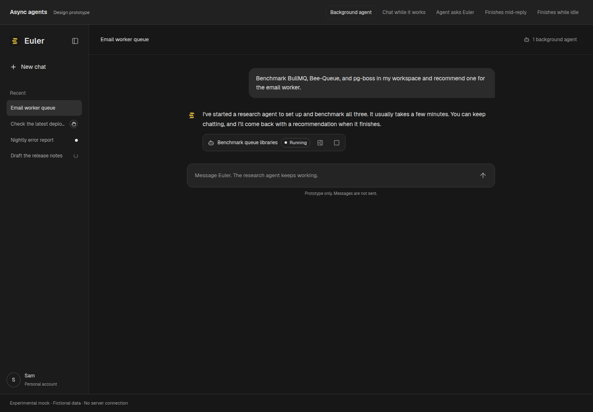

### Chatting while it works

The user asks an unrelated question and then a progress question. Both are ordinary main-agent replies. The progress answer comes from the pending-agent summary in the main agent's context, not from a new tool call.

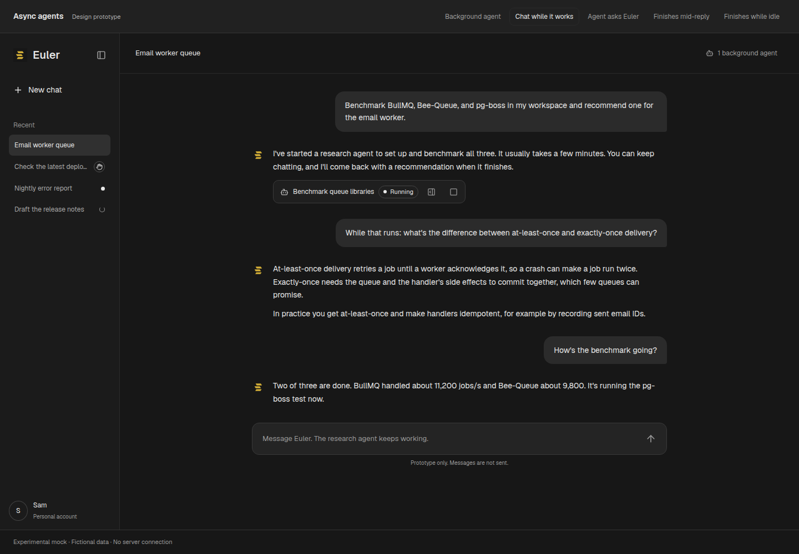

### A subagent asks the main agent

The research agent asks a question and waits. The question wakes the main agent, which cannot decide on the user's behalf and asks the user. The transcript shows only the status row changing to "Waiting for Euler" and the main agent's reply. The question itself is in the Agents panel. The user's answer goes to the main agent, which forwards it with `send_message`.

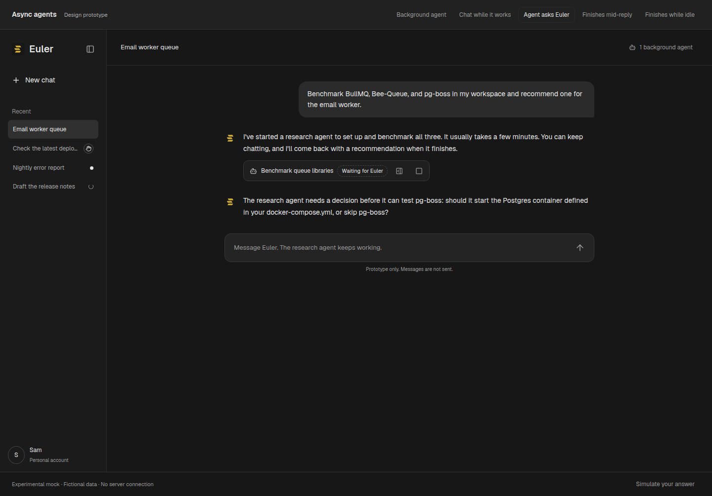

### A subagent finishes while the main agent is mid-reply

The user asked for two things. The main agent started a research agent for one and kept working on the other. The research agent finishes while the main agent is reading a file, so the result waits in the queue. The chat shows nothing extra. The Agents panel marks the result "queued for Euler's next step".

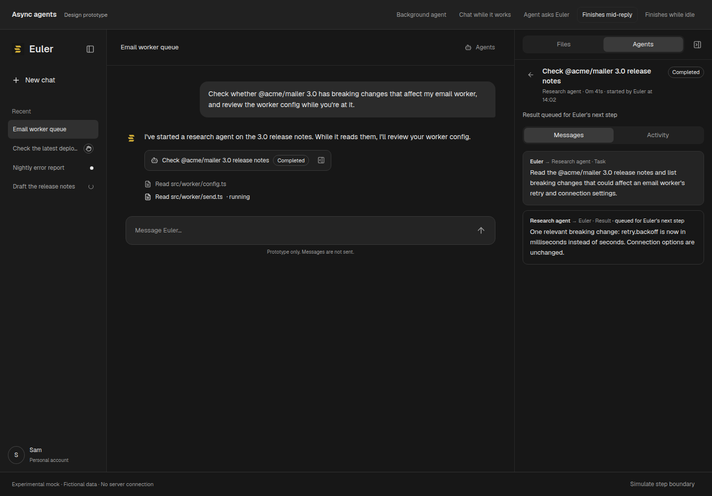

At the next step boundary, the result is delivered, and the same reply continues with an answer that uses both the result and the main agent's own work. Nothing in the chat marks the delivery; the status row already reads Completed. The user didn't have to prompt again.

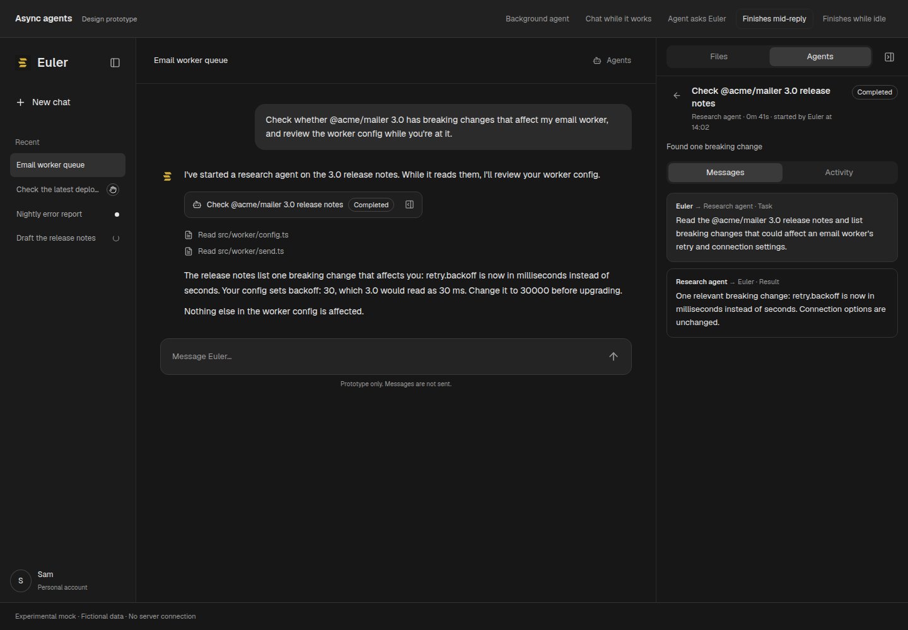

### A subagent finishes while the main agent is idle

The result wakes the main agent, which replies with no user message above the reply and no marker explaining it. The status row reads Completed. If the chat is not open, the sidebar shows an unread dot until the user views it.

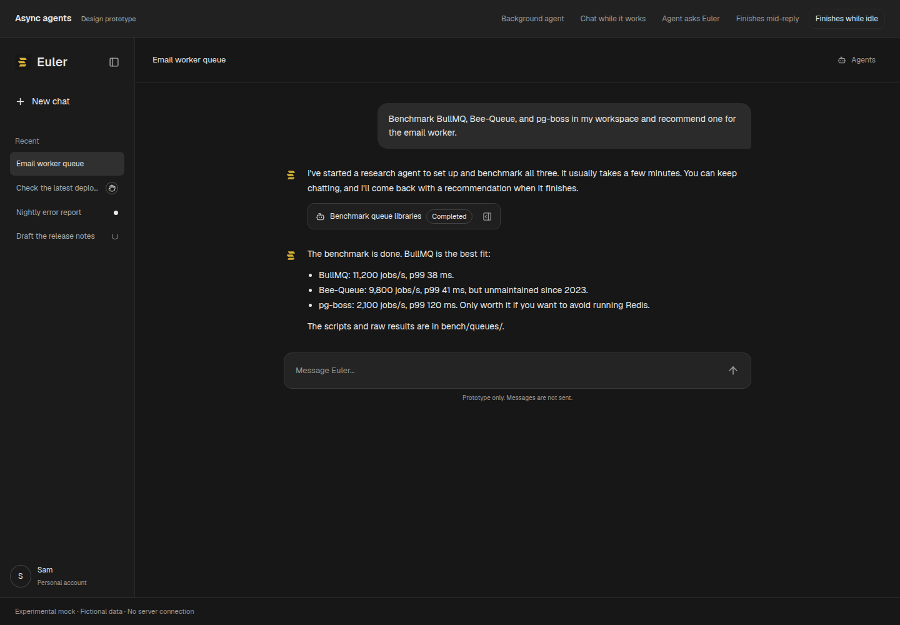

### Agents panel

The artifact sidebar gains an Agents view beside Files. It lists the chat's agents with status, elapsed time, latest activity, and a stop action, and the header button opens it. The count on the Agents tab covers live agents only.

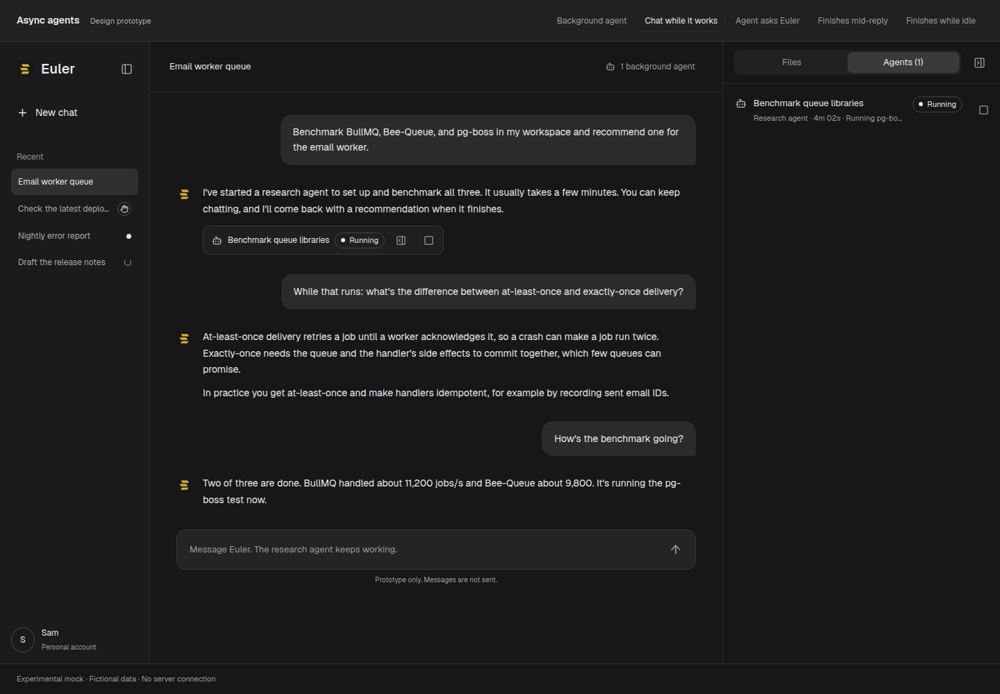

Selecting an agent, or Details on its status row, opens its detail: status, stop, the inbox, and tool activity. Progress messages are marked because they do not wake the main agent. Back returns to the list and to the row that was selected.

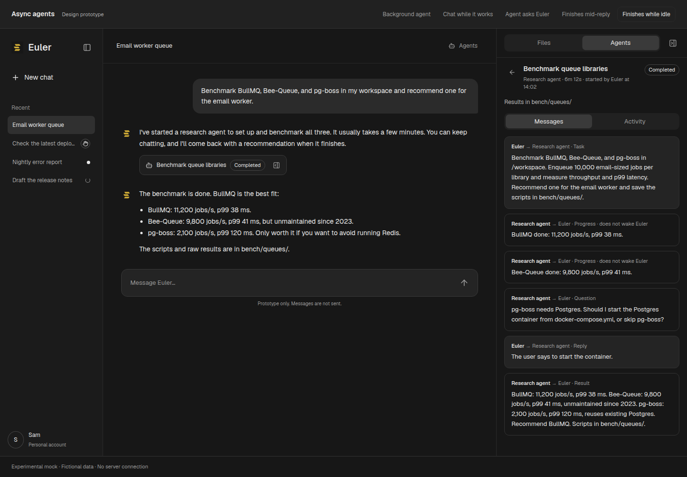

Sidebar badges use three states: a spinner for a working agent, a dot for an unread reply, and a hand for a chat that needs the user. The hand applies only when an agent can't continue without the user, which happens only in phase 2's browser handoff. Each badge has an accessible name.

## Architecture

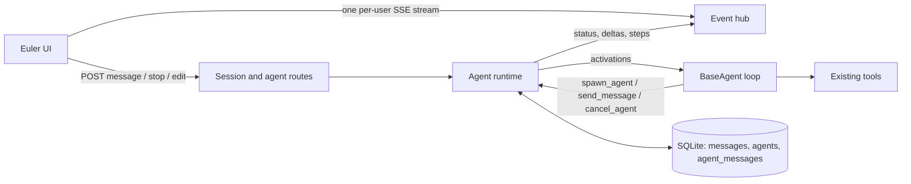

The **agent runtime** is a new server singleton and the only thing that starts activations. It owns scheduling, concurrency limits, cancellation, and restart recovery. HTTP routes enqueue messages and read state; they no longer run turns inside the request.

### What changes from today

| Today | Proposed |
| --- | --- |
| `POST /api/runs` runs a turn inside the HTTP request and streams it as SSE. | `POST /api/sessions/:id/messages` enqueues a user message and returns. The runtime runs the activation. |
| The client sends `history` and `modelMessages` with every turn. | The server loads history from storage. The client never supplies history. |
| Edit and regenerate send a shortened history. | `POST /api/sessions/:id/rewind` truncates on the server, then enqueues the new message. |
| `run_subagent` runs a subagent inside the tool call and discards its history. | `spawn_agent` creates a durable agent. With `wait: true` it keeps today's blocking behavior. |
| One SSE stream per generation, found through `/api/runs/active/:id`. | One per-user SSE stream carries events for every chat, tagged by chat and agent. |
| `workspaceService.beginTurn` is the per-chat busy lock. | The runtime's per-agent activation lock. A chat is busy while any of its agents is live. |
| New input reaches the model only when a turn starts, and the UI blocks sending during a turn. | Every agent consumes inbox events at step boundaries. The composer never blocks. |

`SseManager` already decouples a generation from its HTTP connection. The event hub generalizes that buffer-and-reattach behavior from one generation to all of a user's activations.

## Agents

### Kinds and tools

| Kind | Started by | Tools | Talks to |
| --- | --- | --- | --- |
| `main` | Chat creation | Existing tools, `spawn_agent`, `send_message`, `cancel_agent`, skills | User, its subagents |
| `general` | Main agent | Existing tools except spawning, plus `send_message` to its parent and `ask_parent` | Main agent |
| `browser` (phase 2) | Main agent | Browser tools only, plus `send_message`, `ask_parent`, `request_human_control` | Main agent, user through handoff |

Only the main agent spawns subagents in this version, as `run_subagent` works today. Subagents share the chat's workspace and the model of the model call that spawned them, and keep it: changing the composer's model affects only the main agent, so the composer notes when live subagents use a different one. The model can't choose another one, so a subagent never runs on a model the user didn't pick.

### Status

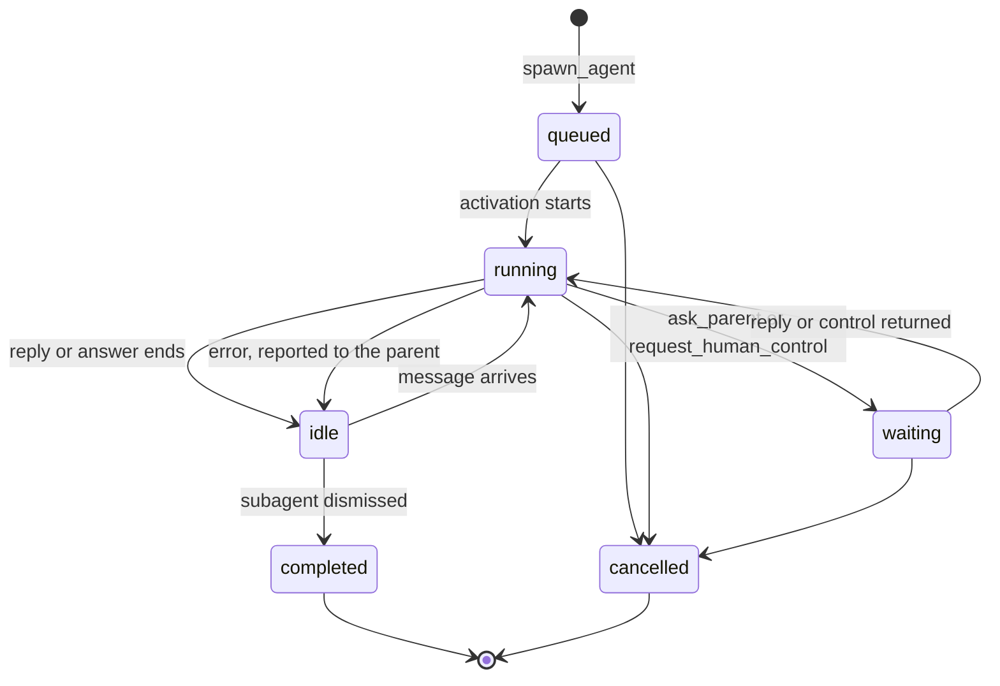

- `queued`: created but waiting for an activation slot.
- `running`: an activation is in progress.
- `waiting`: blocked on a specific reply. The card says who it waits for: "Waiting for Euler" for `ask_parent`, "Needs you" for the browser handoff.
- `idle`: ready. The main agent is idle between replies. A subagent is idle after it answers, keeps its history, and wakes when `send_message` reaches it.
- `completed`: a ready subagent was dismissed by the user or `cancel_agent`. Its summary keeps its last result.
- `cancelled`: a working subagent was stopped.
- `completed` and `cancelled` are final. A final agent keeps its history for its trace and rejects new messages.
- An error ends the activation, not the agent. A subagent that errors becomes ready with its history, marks the error as its interruption, and sends a `failure` message to its parent, which can retry with `send_message`.

When a subagent's model loop ends with a text answer and no pending question, that answer becomes its `result` message to the parent and the subagent becomes ready. It doesn't need a separate `finish` tool. Three subagents per chat may be running or waiting for an answer. New prompts and follow-ups beyond that limit queue until a slot opens; queued and ready agents hold no child slot. A subagent is a reusable conversation, not a single task. Its initial prompt starts that conversation, and later messages can assign different work.

The UI labels these states Queued (`queued`), Working (`running`), Waiting for Euler, Ready, Done (`completed`), and Stopped (`cancelled`). An agent whose last activation was interrupted by an error or restart shows Interrupted. Ready agents show Dismiss instead of Stop. Ended agents are dimmed and open only their trace.

### Limits

| Limit | Initial value | Behavior when reached |
| --- | --- | --- |
| Admitted subagents per chat | 3 | New agents and follow-ups queue while three children are running or waiting for an answer. |
| Concurrent activations per user | 4 | Extra activations wait in `queued`. |
| Browser agents per user | 1 | `spawn_agent` returns `browser_busy` naming the chat that holds the browser. |
| Automatic turns per chat between user messages | 10 | A turn is a model call that delivers agent or runtime messages without user input, across Euler and its subagents, including messages delivered mid-activation. Tool continuations and calls consuming user input are not counted. Further automatic deliveries pause with saved context and pending input until Deliver or a new user message. |

The automatic-turn budget bounds agents waking each other without the user, including messages delivered while an activation is already running. It does not bound how long one activation works: tool loops continue as in a normal reply, and the user can stop any agent. User messages and Deliver reset it. Paused agents keep their history and a continuation in their inbox; a pause does not send a false completion report.

## Inboxes and messages

Every message is a row addressed to one agent. Senders are the user, another agent in the same chat, or the runtime.

| Kind | Sender → recipient | Wakes recipient | Purpose |
| --- | --- | --- | --- |
| `user` | User → main | Yes | A chat message. |
| `task` | Main → subagent | Yes | The first message of a spawned agent. |
| `message` | Main ↔ subagent | Yes | Steering, follow-ups, or answers. |
| `question` | Subagent → main | Yes | Sent by `ask_parent`; the subagent waits for the answer. |
| `progress` | Subagent → main | No | Updates the pending-agent summary. Delivered with the next delivery. |
| `result` | Runtime → main | Yes | The subagent's final answer. |
| `failure` | Runtime → main | Yes | A subagent activation failed; includes the error. The subagent stays ready. |
| `status` | Runtime → main | No | A non-final change the main agent should know about, such as a browser handoff. |
| `control` | Runtime → subagent | Yes | A user action, such as "user returned browser control." Only the runtime can send this kind. |

A user who stops an agent does not wake the main agent. The main agent sees the cancellation in its pending-agent summary with its next delivery.

## Event delivery

Inbox messages are events, and the same rule applies to every agent, main included: **queued messages are delivered at the next step boundary, and an agent with nothing running is woken.** A model call that is streaming or a tool that is executing is never interrupted. Partial output would be wasted, and a half-run tool can't be undone.

| Recipient when a waking message arrives | What happens |
| --- | --- |
| Idle, or `waiting` for this message | The runtime wakes it and a new activation starts, subject to the activation slots and the automatic-turn budget. |
| Running, between steps | Delivered before the next model call. |
| Running, model call streaming | Queued. If the call requests tools, the message is delivered after those tools finish. If the call ends with final text, the activation continues with another model call instead of ending. |
| Running, tool executing | Queued until the tool returns. A long `bash` command or a `wait: true` spawn delays delivery. Meanwhile the Agents panel marks the message as queued. |
| Main activation stopped by the user | Messages already queued when Stop was pressed are held, not delivered automatically, because Stop means "stop". The chat shows "Agent updates waiting" with a Deliver action, and they are also delivered with the user's next message. Messages that arrive after the stop wake the main agent normally. |
| Automatic-turn budget reached | Held, as after a Stop. Automatic messages that arrive while the budget is spent are held as they arrive. Holding is a property of messages; an agent is paused while it has held messages. |
| Sender cancelled by a rewind | Its undelivered messages are dropped. |
| Server restart | Interrupted agents become Ready without starting work. Pending main input is held for explicit delivery; pending child input is retained in its context and marked interrupted. Recovery loads only agents that were working or had pending input or an open reply. |

`progress` and `status` messages never trigger a delivery by themselves. They go along with the next one.

### Ordering and races

- Each agent has one inbox lock in the runtime. Enqueueing takes it to decide whether to wake the agent. Ending an activation takes it to check for pending waking messages before setting the agent idle. A message that arrives just as a reply ends therefore either joins that activation or wakes a new one. It can't be stranded.
- All messages pending at a boundary are delivered together, in insertion order, as one model input. If any subagent's status changed since the last delivery, a refreshed pending-agent summary is included.
- Draining, appending to the agent's model history, and marking messages delivered happen in one SQLite transaction. After a crash, a message is either delivered or still pending, never both.
- After tool calls, the delivered input follows the tool results as a `user`-role message. After final text, it follows the assistant message. Both shapes are valid for the Ollama and OpenRouter APIs Euler uses.

### User messages

User messages follow the same rule. A message sent while the main agent is replying is delivered at its next step boundary, so it can steer the reply in progress. The model and reasoning settings it was sent with apply from that step's model call. Until then it shows above the composer as queued, where it can be edited or removed. If the main agent is idle, the message wakes it, as today.

### Segments

Agent messages delivered mid-reply don't change the visible reply. It continues as one assistant message.

A *user* message delivered mid-reply does split it, because the user's bubble needs a place in the transcript. The runtime closes the current assistant message with its text and steps so far, appends the user's message, and continues in a new assistant message. Each segment is stored when it closes. Segments share an `activationId`, so the UI shows one continuous streaming state and one Stop button across them.

### What the model sees

Providers expect user and assistant turns, so inbox messages from agents or the runtime become one `user`-role model message per drain, wrapped in envelopes:

```text
<agent_message from="research-7f2" name="Research agent" kind="question">
pg-boss needs Postgres. Should I start the Postgres container from docker-compose.yml, or skip pg-boss?
</agent_message>
```

The system prompt states that envelopes are reports from agents or the runtime, never from the user, and that they carry no user authority. The runtime escapes envelope delimiters in message bodies. User messages keep their existing format.

### Pending-agent summary

A delivery to the main agent includes a summary of the chat's live and recently finished subagents when it differs from the last summary the main agent received, which is stored on its record. A chat with no subagents to report gets no summary. A rewind clears the stored summary, so the next delivery sends it again. It goes in the delivered input rather than the system prompt, so prompt caching stays effective:

```text
<background_agents>
- research-7f2 · Research agent · running 4m 02s · "Benchmark queue libraries"
  latest: Bee-Queue done: 9,800 jobs/s, p99 41 ms.
</background_agents>
```

The summary lists live agents and agents that ended since the previous summary. Working agents carry a shortened latest activity line, since results arrive in full as messages. Ready agents list only their name and status, because their latest activity is a result already delivered, unless an interruption such as a restart ended their last activation without a report. This is how the main agent answers progress questions and knows what it has already reported.

## Activations

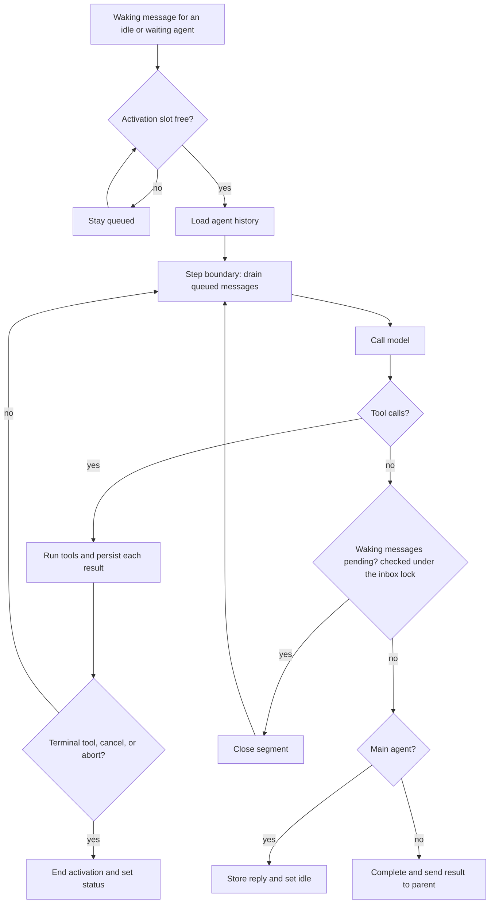

- Only one activation runs per agent. The main agent and its subagents run concurrently.
- The model history is persisted after every tool result, not only at the end. A restart then loses at most one model call. Only messages that changed are written.
- Each step is stored as its own `agent_steps` row, and a `step` event carries only that step. A subagent's rows are its trace, served with the agent detail. A main agent's rows, and its reply text in `agent_replies`, last until its segment reaches the transcript, so a restart can keep the open segment.
- An agent's record is saved when it changes, such as on a status change or a delivery, not on every step.
- Nothing written or sent per step grows with the length of the conversation or the activation.
- **Terminal tools** end the activation after their result is stored: `ask_parent` and, in phase 2, `request_human_control`. `BaseAgent.run` gains a way for a tool result to request this, replacing the idea of a stop flag on `RunContext`.
- An abort (Stop in the UI or `cancel_agent`) uses the existing `AbortSignal` path. Cancelling the main agent's activation does not cancel its subagents. Cancelling a subagent is explicit.
- Tool calls within an activation still run one at a time, as in `BaseAgent.run` today.

## Flows

### Background work, a user message, and completion

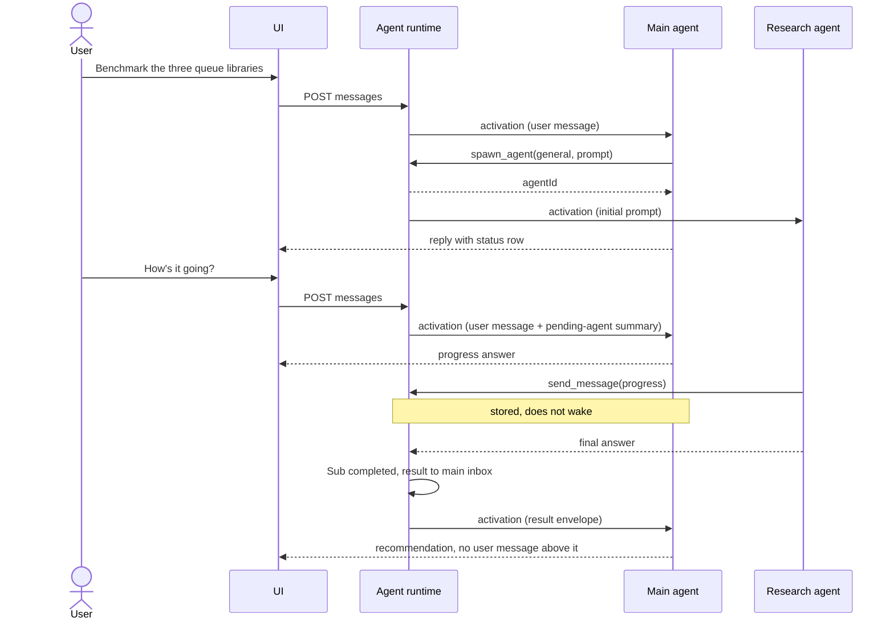

### A question the main agent can't answer alone

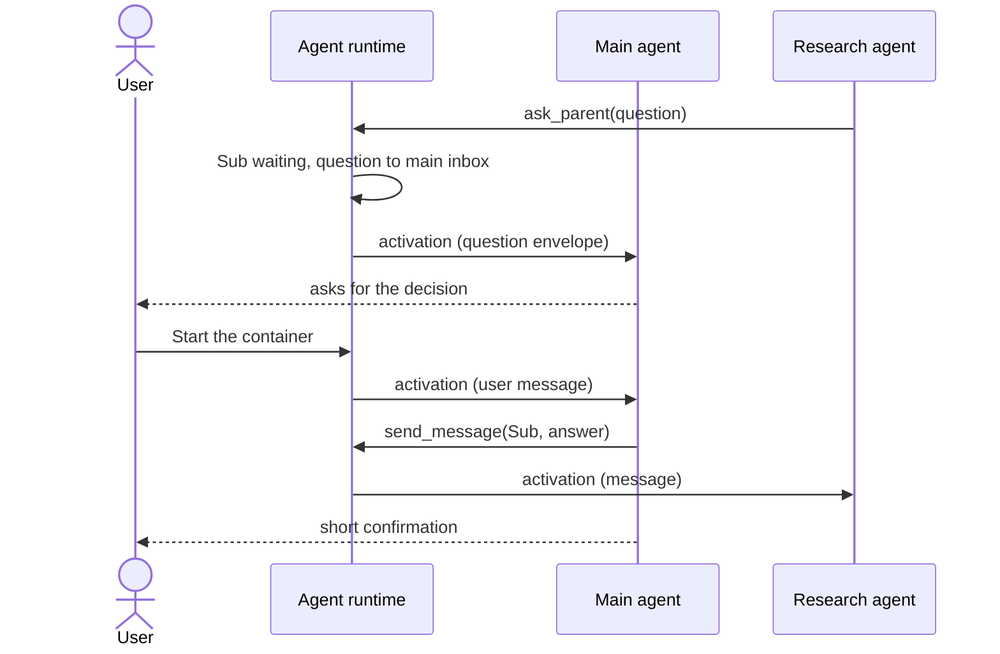

The main agent can answer a question itself when it has enough context. It asks the user only for decisions that belong to the user.

### A result arriving mid-reply

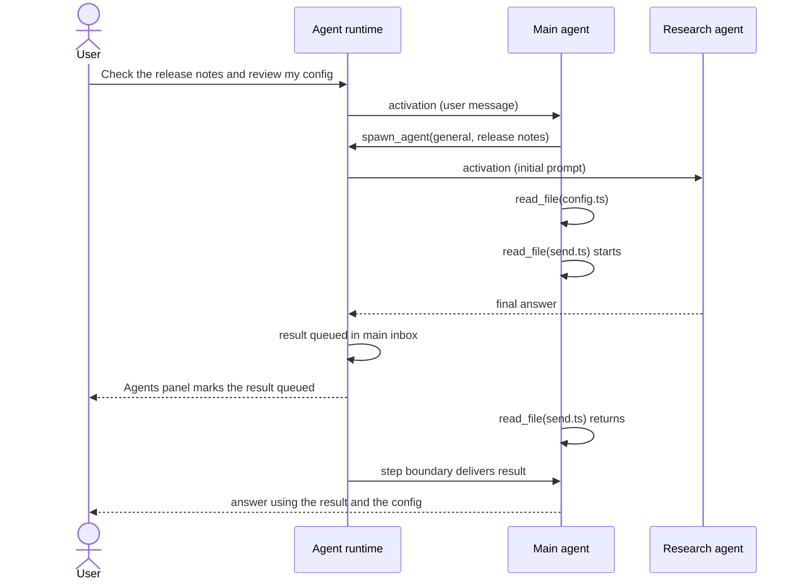

## Tools

### Main agent

| Tool | Arguments | Returns |
| --- | --- | --- |
| `spawn_agent` | `kind`, `title`, `prompt`, optional `wait` (default `false`) | With `wait: false`, the agent ID immediately. With `wait: true`, waits for an answer unless incoming parent input or waiting children require Euler to continue first. A result or failure returned this way is not delivered again as a message. A call that returns before the agent finishes carries its status and a note instead of a result. If the agent calls `ask_parent` first, the call returns with status `waiting` and the question arrives in the caller's inbox. `browser` agents always start with `wait: false`. |
| `send_message` | `to` (agent ID), `content` | Confirmation, or an error if the agent is final. |
| `cancel_agent` | `agentId`, `reason` | Confirmation. The reason appears on the card. |

`run_subagent` is removed. Blocking and background subagents then share one implementation, and blocking subagents also appear in the Agents panel. A startup migration turns each old `run_subagent` trace (its step's `childRun`) into an ended agent, so old traces open in the agent trace modal.

### Subagents

| Tool | Arguments | Behavior |
| --- | --- | --- |
| `send_message` | `content`, optional `kind: "progress"` | Progress to the main agent; does not wake it. Without `kind`, wakes the main agent and the subagent keeps working. |
| `ask_parent` | `question` | Terminal. Sends a `question`, sets the subagent to `waiting`, and ends its activation. The answer wakes it. |
| Final answer | — | Ending the loop with text completes the agent and sends a `result`. |

The system prompt for subagents tells them to use `progress` sparingly, at meaningful milestones.

## Transcript and UI

### Visible transcript

The transcript is the conversation between the user and Euler, plus one status row per subagent. Everything else about agents is in the agent trace.

The chat's `messages` table stays the user-visible transcript, with its existing `user`, `assistant`, and `event` roles. Agents add no transcript roles or rows. Their messages, questions, results, failures, and cancellations are stored in `agent_messages` and on the `agents` row. The agent trace shows the initial prompt and the agent's steps.

- The **status row** is rendered from the `spawn_agent` step of the reply that started the agent. It shows the agent's icon, title, and status, and Stop while the agent is live. Clicking it opens the agent trace. It has no activity line, elapsed time, or message text. Its live status comes from agent status events, not from the stored step.
- Questions, results, and failures reach the user only through the main agent's reply, which restates what matters.
- Queued agent messages are never shown in the transcript. Only the user's own queued message appears above the composer until it is delivered.
- A reply the runtime starts because of an agent message appears directly after the previous message, with no user bubble or marker. The agent's status row and its trace explain it.

### Agents list

The artifact sidebar shows a SegmentedControl, **Files | Agents**, once the chat has a subagent. Having a subagent also makes the sidebar toggle available when the workspace has no files.

- The list groups every subagent in the chat under **Active** (working or waiting for Euler), **Ready** (Euler can message it), and **Ended**, each newest first, so an agent started early in a long chat stays easy to find. Each heading shows its count. Empty groups are hidden, and Ended starts collapsed.
- Each row is the status row plus a one-line summary of the agent's latest activity: its initial prompt, latest message, or result.
- The Agents tab label counts working agents.

### Agent trace

Clicking a status row or list row opens the agent in the execution trace modal used for replies:

- The header shows the agent's title and status, Stop while the agent is live, and copy trace results.
- The body shows the agent's initial prompt, token and cost metrics, and its numbered steps. Questions and messages the agent sends appear as its tool calls.
- The trace refreshes every second while the agent is live and stops polling once it is final.
- Escape or Close returns focus to the status row.

### Controls

| Control | Location | Effect |
| --- | --- | --- |
| Stop (existing) | Composer while the main agent replies | Aborts the main activation, across all its segments. Subagents keep running. |
| Stop agent | Status row, Agents list row, agent trace header | Cancels that subagent. Its status row reads Cancelled; nothing is added to the transcript. |
| Status row | Transcript, Agents list | Opens the agent trace. |
| Send | Composer | Always enabled for persisted chats. Mid-reply, the message shows as queued until its step boundary. |
| Deliver | "Agent updates waiting" notice | Delivers held messages after a Stop or when the automatic-turn budget was reached. |

### Sidebar and unread state

`sessions` gains `last_activity_at` and `last_viewed_at`. The badge is:

1. "Needs you" if any agent waits for the user.
2. Otherwise "Agent working" if any agent is queued or running.
3. Otherwise "New reply" if `last_activity_at > last_viewed_at`.

Opening a chat updates `last_viewed_at`. The sidebar's order continues to use `updated_at`, which agent-initiated replies also advance.

## Server-owned history

### API

| Endpoint | Purpose |
| --- | --- |
| `POST /api/sessions/:id/messages` | `{ content, attachmentIds, model, reasoningEffort, metadata }`. Stores the user message, enqueues it, and returns `{ messageId, queued }`. |
| `POST /api/sessions/:id/rewind` | `{ position, content?, versions?, model?, reasoningEffort?, metadata? }`. Edit and regenerate, with the composer settings a new message carries. Cancels and deletes agents spawned at or after `position`, truncates, then enqueues. |
| `POST /api/sessions/:id/stop` | Aborts the main activation. |
| `GET /api/sessions/:id` | Existing session payload plus `agents` and the in-progress activation's partial state. |
| `GET /api/sessions/:id/agents/:agentId` | Agents panel detail: inbox and steps. |
| `POST /api/sessions/:id/agents/:agentId/cancel` | Stop agent. |
| `DELETE /api/sessions/:id/messages/:messageId` | Remove a queued user message before delivery. |
| `POST /api/sessions/:id/deliver` | Deliver messages held after a Stop or the automatic-turn budget. |
| `GET /api/events` | The per-user SSE stream. |

`POST /api/runs`, `/api/runs/active/:id`, `/api/runs/stream/:id`, and `/api/runs/abort` are removed with their UI callers. `/api/runs/debug-prompt` moves under sessions, unchanged.

All request and event contracts live in `src/schemas/agents.ts` and `src/schemas/events.ts` as Zod schemas shared with the UI.

### Event stream

The UI opens one fetch-based SSE stream per tab with the `x-euler-user-id` header, as `readSseBlocks` supports today. Events carry a per-user sequence number:

| Event | Payload |
| --- | --- |
| `activation_started` | `sessionId`, `agentId`, `activationId`, `trigger` (`user`, `agent`, `recovery`) |
| `delta` | `activationId`, content and thinking deltas |
| `step` | `activationId`, the changed step and its position in the open segment |
| `segment_closed` | `activationId`, stored assistant message, delivered rows that follow it |
| `activation_ended` | `activationId`, outcome (`done`, `aborted`, `error`), stored message IDs |
| `inbox_queued` | `sessionId`, `agentId`, IDs of queued messages, for the queued markers in the Agents panel |
| `agent_status` | `sessionId`, agent summary |
| `transcript_appended` | `sessionId`, stored message |
| `session_activity` | `sessionId`, badge state |

On reconnect the client sends `Last-Event-ID`. The hub replays buffered events for in-progress activations. If the gap is too old, it sends `resync`, and the client refetches the open chat. Events for chats that aren't open update only the sidebar.

### Temporary chats

Temporary chats keep their state in server memory for the lifetime of their workspace lease instead of in the browser tab. They use the same runtime. A server restart ends them and cancels their agents, which matches what "temporary" already means. The client-supplied history path is removed for all chats.

## Persistence

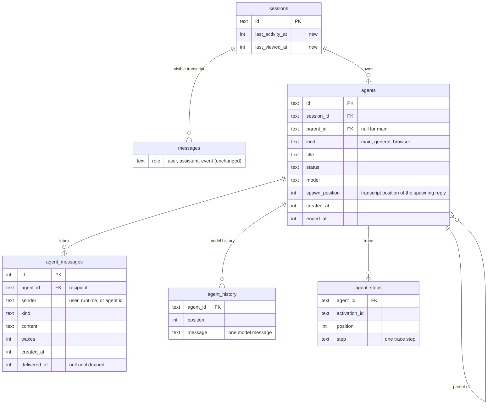

- Every chat has a main agent row, so history, the inbox, and status apply to it and to subagents uniformly. A startup migration moves `sessions.model_messages` and subagent history JSON into `agent_history`, creating main agents for older chats.
- `agents` and `agent_messages` cascade on session deletion, after the runtime has cancelled live agents.
- `spawn_position` tells a rewind which agents to cancel and delete.
- Persisting `messages` becomes append-and-update by message ID instead of rewriting by position, because agents and the user can now add rows concurrently.

## Lifecycle rules

| Event | Effect |
| --- | --- |
| Main agent's reply ends | Subagents keep running. |
| User sends a message | Wakes the main agent, or is delivered at its next step boundary if it is replying. |
| Stop in the composer | Aborts the main activation only. Messages queued at that moment are held. |
| Stop agent | Cancels that subagent and its pending inbox, and withdraws its unanswered question. |
| Edit or regenerate | Cancels and deletes agents with `spawn_position` at or after the rewind point, including their inboxes and reports, then rewinds. The confirmation dialog names them. |
| Delete chat | Cancels all agents, waits for activations to settle, then deletes. Browser data is untouched (phase 2). |
| Change workspace | Rejected with 409 while any agent is live, as it is during a turn today. |
| Change model | Applies to the main agent's next activation. Running subagents keep theirs. |
| Server restart | See recovery below. |

Subagent rows and traces show their fixed model and provider icon. A subtle warning marks agents whose last activation ended in an error or a server restart. The reason stays until the agent's next activation or dismissal.

### Restart recovery

On startup, recovery preserves reusable agents but starts no model calls:

1. Interrupted main replies are kept and marked interrupted. Pending main input is held until Deliver or a new user message.
2. Running and queued subagents, and waiting subagents with pending input, become Ready with the same ID and saved history. Pending child messages are moved into that history followed by an interruption notice, so they are context rather than automatically resumed work. A waiting subagent with nothing pending was not interrupted and keeps waiting for its answer.
3. Missing tool results are repaired with an interruption message. Tools may have partly performed side effects; new instructions must not blindly repeat them.
4. Ready agents remain available for new prompts through `send_message`. Final agents remain final. Temporary chats still end with the server process.
5. Each recovery transition commits its history, inbox changes, and status together. Creating an agent and enqueueing its initial prompt also commit together.

## Security

- Every agent, message, and event is scoped by owner UUID and chat. A message can only be addressed to an agent in the same chat.
- User authority never travels as message text. Stop, resume, rewind, and phase 2 control transfer are API actions the runtime records as `control` messages. An agent cannot send `control`.
- Subagent output is untrusted input to the main agent. Envelopes mark it, and the main agent's prompt forbids treating it as user instruction. This matters most for the browser agent, which reads arbitrary pages.
- Cost limits bound the number of agents, concurrent activations, and automatic turns without the user.

## Prior art

- **Meta Muse** runs a separate browser subagent, pauses it when the user takes control, and exposes `subagent.spawn`, `subagent.close`, and `subagent.resume` to the session, according to [Meta's safety post](https://research.meta.ai/blog/security-and-safety-for-ai-agents-our-approach-with-muse) and [black-box testing of its control plane](https://blog.cygankiewicz.com/en/meta-muse-black-box-testing/). Its safety approvals arrive as system dialogs rather than conversation messages ([The Batch](https://charonhub.deeplearning.ai/how-to-secure-agents-for-the-masses/)), which the `control` message kind follows.
- **Google Antigravity** runs subagents as background tasks: the main agent "invokes the subagents and immediately yields control back to the user," and subagent output streams to the main agent's progress log ([Antigravity blog](https://antigravity.google/blog/google-io-2026-feature-deep-dive)). Its browser subagent is a blocking tool call without user takeover ([reverse engineering notes](https://alokbishoyi.com/blogposts/reverse-engineering-browser-automation.html)).
- **Claude Code** background tasks start a new main-agent turn when they finish, with no user input. That is the wake model used here.

## Code map

| Responsibility | Location |
| --- | --- |
| Runtime, scheduling, limits, recovery | `src/agents/runtime/AgentRuntime.ts` |
| Activation: load, drain, run, persist | `src/agents/runtime/AgentRuntime.ts` |
| Envelopes and pending-agent summary | `src/agents/runtime/agentContext.ts` |
| Agent and inbox persistence | `src/db/agents.ts`, migrations |
| Contracts | `src/schemas/agents.ts`, `src/schemas/events.ts` |
| Event hub and SSE route | `src/events/eventHub.ts`, `src/app.ts` (replaces `src/run/sseManager.ts` and `runStream.ts`) |
| Message, rewind, stop, and agent routes | `src/routes/agentActions.ts`, mounted for persisted and temporary chats |
| Tools | `src/agents/runtime/AgentRuntime.ts` runtime tools (replace `run_subagent.ts`) |
| Terminal tool results, step-boundary hook, segment closing | `src/tools/BaseTool.ts` (`ToolResult.endActivation`), `src/agents/BaseAgent.ts` (a `beforeModelCall` hook the activation uses to drain the inbox, and a continue-if-pending check at the end of the loop) |
| UI requests | `ui/persist/sessions.ts`, new `ui/persist/agents.ts`, `ui/persist/events.ts` |
| UI state | `useAgentEvents` for snapshots and events; `useRunStreaming` for composer actions. Replaces `useRunResume`, `reconcilePersistentRun`, and `executeRunTurn` |
| UI components | `ui/components/Agents/` (`AgentTaskCard` for the status row, `AgentsList` for the sidebar, `AgentTraceModal` wrapping `StepsModal`), the queued user-message row in `RunArea`, `SessionListItem` badge |

## Delivery

Steps 1–3 ship together in the first MVP commit. Follow-up commits contain fixes. Step 4 remains separate.

1. **Server-owned turns.** Add the message, rewind, and stop routes, server-loaded history, message persistence by ID, the per-user event stream, and in-memory temporary chats. Move the UI to them and delete `/api/runs` and the client history path. There are no agents yet, and behavior matches today.
2. **Background agents and event delivery.** Add:
   - the `agents` and `agent_messages` tables and the runtime
   - `spawn_agent` in both modes
   - step-boundary delivery for every agent, with segments, queued user messages, and held updates after Stop
   - completion and failure wakes, and the pending-agent summary
   - status rows, the Agents panel, badges, and stop agent
   - rewind and delete rules, and restart recovery

   Remove `run_subagent`.
3. **Messaging.** Add `send_message` in both directions, `ask_parent`, progress messages, and the automatic-turn budget.
4. **Browser use** ([phase 2](browser-use.md)).

### Verification

- Unit tests:
  - inbox ordering and exactly-once delivery across a simulated crash
  - wake rules per message kind
  - the race between a reply ending and a message arriving, both orders
  - held messages after Stop and after the automatic-turn budget
  - the automatic-turn budget itself
  - rewind cancellation by `spawn_position` and dropping of its undelivered messages
  - recovery of an orphaned tool call
- Runtime tests with a scripted model:
  - spawn → user message during work → completion wakes an idle main agent
  - completion during a main tool call → delivered at the next boundary → segments stored
  - completion during the main agent's final model call → the activation continues
  - question → reply → resume
  - a user message steering a reply in progress
  - cancel mid-tool
  - limits
- Browser tests:
  - sending while an agent runs, and a queued user message becoming a delivered row
  - the status row showing only name, status, and controls
  - no agent questions, results, deliveries, queued updates, or stops in the transcript, only in the panel
  - an agent-initiated reply appearing in an open chat
  - badges on a closed chat
  - reconnect replay across segments
  - agent trace from the status row and Agents list, status, and Escape
  - mobile layout
- Migration test from a database with existing chats.

## Continue this work

The mock lives in [`dev/experimental/async-agents/`](../../dev/experimental/async-agents/README.md). Open `/dev/experimental/async-agents` with the Vite dev server. `?scene=started|chatting|question|inflight|finished` opens a scene directly. `&panel=list` or `&panel=detail` opens the Agents panel.

Open questions:

- Should the main agent be able to wait for a background agent within one activation, for example "wait up to 2 minutes"? The current design says no: it ends its reply and gets woken, or receives the result at a step boundary if it is still working.
- Should a user message sent mid-reply steer that reply, as designed here, or wait until the reply ends?
- Is 10 automatic turns per chat between user messages the right budget, or should the budget be cost-based?
- Should finished agents' histories expire, or live as long as the chat?

### Runtime storage and output ownership

Agent status and inbox delivery flags use indexed database columns. Display
queries do not load model history into the runtime cache. The runtime keeps
shared mutable records while a chat has active work and releases persistent
records when it goes idle. Runtime operations re-read records after waits;
routes use display snapshots and runtime methods instead of mutating records.
Temporary chats remain in memory until their existing lifecycle cleanup runs.

Activation execution lives in `src/agents/runtime/activation.ts`, separate from
scheduling and conversation control. Agent tools live in `src/tools/` and
validate their arguments with Zod. Database transactions defer events and
scheduler notifications until commit and restore cached state on rollback.

Reply file attachments come from paths reported by successful `create_file`
and `apply_patch` calls. Shell commands can supply `outputFiles` to identify
files to attach after a successful exit. The runtime resolves and stats only
those paths; it no longer scans the workspace or attributes files by modification
time. Missing files, directories, and paths outside the workspace are omitted.
Attachments refer to current workspace files, not immutable snapshots of their
contents.
