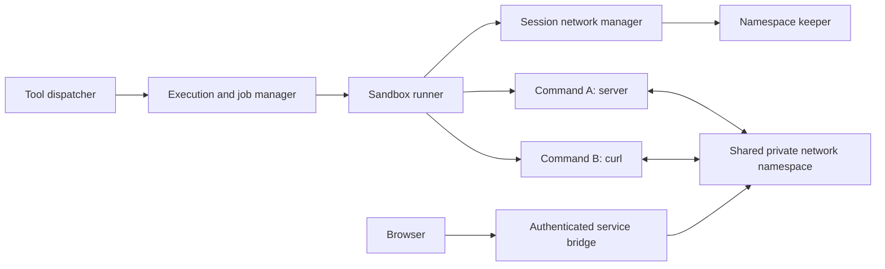

# Background tools and shared session networking

Background tool execution is implemented. Shared session networking and browser
service exposure below remain proposals.

## Feature 1: background tool execution

Tools opt in through [BackgroundCapable](../../src/tools/background.ts).
The dispatcher adds `background: boolean` to their model-facing definition,
validates it, and returns a job handle immediately when requested. Unsupported
tools reject the argument. Bash uses the same process runner in both modes.

```text
bash({ command: "echo READY; sleep 10; echo DONE", background: true })
  -> { jobId: "job_123", status: "running" }

get_job({ jobId: "job_123" })
  -> { status: "running", output: { blocks: [{ kind: "code", text: "READY\n" }] }, ... }

cancel_job({ jobId: "job_123" })
  -> { status: "cancelled", ... }
```

`get_job` returns the current status and retained output snapshot. The starting
agent and its same-session ancestors can inspect or cancel the job. Completion
also sends one durable runtime inbox message to its owner, using the existing
[agent scheduler](async-agents.md). A normal reply ending leaves the job running.
Stop, dismissal, rewind, and session deletion cancel affected jobs and await
process cleanup. Backend restart marks unfinished jobs interrupted, with a
non-waking notification; it never restarts work automatically.

Tools own their Input, optional Progress, Output, and optional Metadata through
[ToolContent](../../src/schemas/toolContent.ts), which supports text, code, and
fields. Progress and Output accept append or replace updates and retain bounded
64 KiB snapshots. The shared renderer does not branch on tool names. Bash
streams stdout/stderr into one Output block, retained at completion, and returns
the real process exit code as Metadata. Nothing infers status from printed text.

The [job manager](../../src/jobs/JobManager.ts) owns IDs, agent/session ownership,
status, timestamps, cancellation, limits, persistence, and notifications. Retained
jobs use SQLite; temporary jobs stay in memory. Live handles and intermediate
output are memory-only, so a crash can lose recent logs. Runtime boundaries and
stored records use shared Zod schemas. Defaults allow four active jobs per
session and sixteen per user, including starting jobs.

The Jobs sidebar and inline job cards open the same modal. It polls running jobs
once per second, shows one output block and collapsed Metadata, and keeps timing
separate from tool content. Elapsed time updates while active and freezes when
finished. Requests live in `ui/persist/jobs.ts`; reload restores runtime state.

Background Bash drains output even after old logs are discarded, keeps filesystem
and PID isolation, and cancels descendants. It removes the foreground wall/CPU
timeouts so a service can keep running. Foreground limits are unchanged. Commands
still use separate isolated networks; a service started in one command is not
reachable from another command or a host browser through this feature.

Verification lives in `tests/e2e/backgroundJobs.test.ts`, `tests/jobs/`,
`tests/sandbox/background.test.ts`, and `tests/browser/jobs.pw.ts`. It covers real
Bash completion, live inspection, attachments, failure, admission limits, output
bounds, descendant cleanup, temporary sessions, rewind, deletion, restart, and UI
reload/cancellation. The browser fixture uses deterministic model replies with
the actual HTTP server, SQLite, and Bash runner. Screenshots and recordings are
under `.cache/jobs-evidence` and `.cache/browser-results`.

## Feature 2: shared networking per session/workspace

### Scope and architecture

Use a runtime environment key of `{ ownerUuid, sessionId, workspaceGeneration }`.
The generation changes when the resolved workspace changes or its environment
is retired. Do not key namespaces by host path: two chats pointed at the same
repository must be able to use the same port without joining each other's
services. Parent and subagents within a session share networking deliberately.



A small trusted keeper maintains a private network namespace and its owning
user namespace, with loopback configured. The keeper has no need to execute
agent command strings or mount the workspace. Commands join the session
network through a trusted launcher, then get their own Bubblewrap filesystem
and PID namespaces, existing workspace mounts, and cleared environment.

Keep namespace setup and joining out of Bun's multithreaded server process.
The Linux namespace join has capability and user-namespace constraints; this
requires a subprocess/helper and a capability probe, not merely a `--share-net`
flag. `--share-net` retains the launcher's network, so applying it directly to
the current host-side runner would expose host networking. See the
[Bubblewrap source](https://github.com/containers/bubblewrap/blob/main/bubblewrap.c)
and [Linux setns documentation](https://man7.org/linux/man-pages/man2/setns.2.html).

The exact helper and namespace-join sequence is a feasibility gate. Prototype
it under both ordinary-user execution and the existing root-to-local-owner
path before implementing it broadly. Pass pinned namespace descriptors through
trusted process plumbing; do not treat reusable host PIDs as environment IDs.
Commands must not receive keeper-control sockets or namespace descriptors after
setup. Drop setup capabilities before executing agent code.

If setup is unsupported, return an actionable diagnostic. Existing isolated
foreground commands can remain available when their capability probe succeeds,
but do not silently claim they have shared networking or fall back to host net.

### Lifetime and concurrency

Create the environment lazily, with a single in-flight creation per key. Both
foreground commands and background jobs hold leases. Keep it alive while any
command, job, or exposed service needs it; tear down once no leases remain.
Closing a normal reply does not release a running job's lease.

Keeper death invalidates that generation and interrupts its jobs. Stop remaining
commands and bridges before permitting a fresh generation. Session mutations
must close admission first, then drain leases, then change or delete workspace
state. Integrate with the existing runtime mutation guards rather than adding
an unrelated busy flag.

Update workspace switching and temporary-expiry checks to account for job
activity. A running server keeps a temporary workspace leased; explicit session
deletion still overrides the lease and cancels it. A later idle-expiry policy
for abandoned servers can be added separately.

### Connectivity contract

- Every command in the same live environment sees the same loopback services.
- Identical ports in separate sessions do not collide.
- Commands retain independent PID and mount namespaces; a shared shell,
  persistent `/tmp`, and process discovery are not promised.
- Loopback-only services work without asking them to bind all interfaces.
- No host sockets, host LAN, other-session network, or outbound internet access
  becomes available. External dependency installation remains a separate policy.

### Browser access and explicit service exposure

Implement a narrow service bridge as a separate stage of this feature. Proposed
shared operations are `expose_service({ port })` and `close_service({ serviceId })`.
Exposure returns an opaque ID and browser-reachable URL; it never interprets a
server's log URL as a host address. It is networking behavior, not Bash-specific
behavior or part of the generic job contract.

The backend opens the destination through a restricted connector inside the
session namespace and proxies HTTP plus WebSocket upgrades to its loopback
port. The connector accepts validated ports for its fixed environment, not
arbitrary hostnames, URLs, or agent-provided commands. Prefer a per-service
origin to path prefixes so absolute asset paths and HMR work correctly.

Authorize service creation and access for the owner/session. Carry authorization
through a short-lived, service-scoped browser bootstrap and an isolated service
cookie or equivalent; keep the app's authentication cookies off untrusted dev
origins. The browser URL must work on the deployment's actual hostname, not
just on the backend machine's localhost. Verify host headers, Origin checks,
WebSockets, redirects, and service-worker isolation with a real dev server.

Expose only explicitly selected ports. Closing exposure revokes its URL without
killing the server. Cancelling the backing job, retiring the generation, or
deleting the session closes its exposures. Associate an exposure with a known
job where possible; otherwise its lease ends explicitly or with the environment.
Do not accidentally route old URLs to a new generation's reused port.

Per-service routing and browser authentication are a second feasibility gate.
Until this stage ships, state that command-to-command networking works while
host/remote browser access is unavailable. Do not call the entire dev-server
workflow complete without browser reachability and HMR verification.

## Proposed networking integration and acceptance checks

Service state should extend the existing runtime snapshots and use the same
user-scoped APIs, shared schemas, and `ui/persist/` request helpers as jobs.
Service URLs need authenticated access and revocation when their leases end.

1. Prove namespace joining with a loopback server started in one isolated command
   and requested from another. Verify session/host isolation, separate sessions
   using the same port, local-owner file permissions, and descendant cleanup.
2. Route session Bash calls through the leased environment. Test server/curl
   across calls, parallel agents, keeper death, and resource teardown. Require a
   supported Linux CI run before claiming verification.
3. Add browser service exposure on the deployment origin. Verify assets and HMR
   WebSockets, reload, cancellation, URL revocation, and denial of another user's
   service. This completes the dev-server workflow.

Keep job lifecycle checks separate from real namespace tests so missing Linux
capabilities cannot hide job-state failures.

## Deferred work

- Readiness patterns, automatic polling, and a bounded wait tool.
- Durable full logs and process reattachment after restart.
- Background image generation. It is a useful second capability implementation,
  but must support meaningful failure and cancellation of its remote work.
- Networking shared across distinct chats using the same local workspace.
- Internet egress, dependency-install networking, and broader persistent
  container environments.
