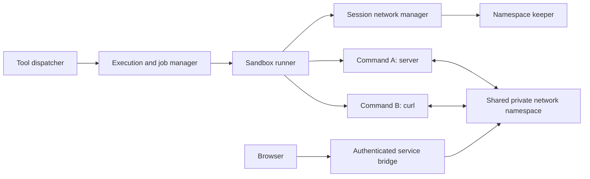

# Background tools and shared session networking

Status: proposed design, implementation has not started.

Updated: 2026-09-29.

## Purpose

Let agents start long-running tools, continue working, and receive their results
later. Let shell commands in the same session reach services started by earlier
commands, including development servers. Both features are required for the
workflow: start a server, test it from another command, inspect it in a browser,
and stop it when finished.

This extends the [existing agent runtime](async-agents.md). Jobs are tool
executions, not agents: they have no model history or scheduling budget of their
own. Their completion messages use the existing inbox and activation scheduler.

## Proposed product decisions

- Tools opt into background execution through a typed capability interface.
  Bash is the first implementation. Web search remains foreground-only.
- Capable tools expose `background: boolean`, defaulting to false. The shared
  tool layer owns this argument and rejects it for unsupported tools.
- Foreground and background execution share the same tool operation.
- Jobs belong to the agent that started them, within its owner and session.
  Ending a reply leaves them running; explicit cancellation or dismissal stops
  them. Session deletion stops all jobs before workspace removal.
- Jobs emit terminal inbox notifications, not a message for every log chunk.
- Network scope is one session and one active workspace generation. Sharing a
  local directory between chats does not share their ports or services.
- Commands keep separate filesystem and PID isolation while sharing session
  networking. Host networking and outbound internet access are not enabled by
  this change.
- Backend restarts interrupt jobs and discard network environments. Neither
  commands nor servers are automatically restarted.
- Browser access uses explicit service exposure. A URL containing `localhost`
  inside the sandbox is not directly usable by a host or remote browser.

These are implementation defaults for this proposal, not shipped behavior.

## Current constraints

[`BaseAgent`](../../src/agents/BaseAgent.ts) awaits every tool and then records
one result in model history. Keep that provider-required call/result pairing:
a background call receives a job handle immediately, and completion is a new
runtime message rather than a second result for the original call.

[`RunContext`](../../src/RunContext.ts) is activation-scoped. Its signal, steps,
written-file set, and attachment collection must not own background execution.

[`SandboxRunner`](../../src/sandbox/SandboxRunner.ts) currently creates a fresh
network namespace for each call with `--unshare-all`. It also applies a
120-second wall timeout, a 60-second CPU limit, and kills commands when their
2 MiB output budget fills. Returning early from Bash does not fix those limits
or make one call's server reachable from another.

[`WorkspaceService`](../../src/workspaces/WorkspaceService.ts) supports both
retained and temporary chats, and local directories. Expiry and workspace
switching currently depend on agent activity. Running jobs need an execution
lease even when every agent is idle.

## Feature 1: background tool execution

### Agent interaction

```text
bash({ command: "bun run dev", background: true })
  -> { jobId: "job_123", status: "running" }

get_job({ jobId: "job_123", cursor: 0 })
  -> {
       status: "running",
       output: [{ cursor: 1, channel: "stdout", text: "Listening on :5173" }],
       nextCursor: 1,
       outputTruncated: false
     }

cancel_job({ jobId: "job_123" })
  -> { jobId: "job_123", status: "cancelled" }
```

`get_job` returns status even when there is no new output. On completion it also
returns the result or error. Reads have a bounded output size. Terminal results
remain available after inbox delivery, subject to session retention.

Start does not imply readiness. The agent can read logs and run an HTTP health
check. Output-based readiness patterns and a bounded wait tool are deferred.

### Capability and dispatch

Illustrative contracts, with shared schemas to be added under `src/schemas/`:

```ts
interface BackgroundCapable {
  start(
    args: Record<string, unknown>,
    ctx: JobContext,
  ): Promise<RunningExecution>;
}

interface RunningExecution {
  completion: Promise<ToolResult>;
  cancel(): Promise<void>;
}

interface JobContext {
  ownerUuid: string;
  sessionId: string;
  agentId: string;
  workspace: Workspace;
  signal: AbortSignal;
  emitOutput(chunk: { channel: "stdout" | "stderr" | "progress"; text: string }): void;
}
```

Use a typed capability guard. Do not infer support from a tool name, advertise
background mode for every `BaseTool`, or maintain a second allowlist of capable
tools. One shared schema builder adds the reserved `background` argument only
when the interface is implemented. Runtime validation requires an actual
boolean and strips that argument before validating the tool's own arguments.

The dispatcher uses an injected execution service, exposed through the run
context, rather than importing `AgentRuntime`. Ordinary tools retain their
existing `execute()` path. Capable tools use `start()` for both modes; Bash's
existing execution body moves into that path, with no second spawn implementation.

Output publishing is installed before work starts. A subscribe-after-start
interface can lose the first output chunks. Attach completion handlers
immediately so early failures cannot become unhandled promise rejections.

`start()` acknowledges creation of an execution handle, not successful completion
or readiness. Validation errors return directly. Spawn failures either fail
start or settle the created job, depending on when they occur.

### Job manager and storage

Add a server-owned job manager beside the agent runtime. It owns:

- Job IDs, owner/session/agent relationships, originating activation and step,
  workspace generation, timestamps, and a bounded human-readable description.
- Admission limits, execution handles, independent abort controllers, and
  workspace/network leases. Reserve capacity before starting work.
- A bounded output tail, initially 64 KiB per job, with monotonically increasing
  chunk cursors. Report gaps when a cursor predates retained output. Continue
  draining process pipes when old logs are discarded.
- Terminal results, cancellation reasons, and completion notifications.

Use tool-independent states:

```ts
type JobStatus =
  | "starting"
  | "running"
  | "succeeded"
  | "failed"
  | "cancelled"
  | "interrupted";
```

Keep Bash exit code and signal in result metadata. Do not parse result text such
as `Error:` to discover failure. Capable implementations must reject or return
an explicit typed failure when the operation fails. A future ComfyUI adapter
can use the same interface without fabricating process exit codes.

Persist retained-session metadata, terminal results, and a bounded terminal
output tail using the existing SQLite patterns. Live handles and intermediate
logs are memory-only initially; acknowledge that a crash can lose recent logs.
Temporary chats use memory-backed records, matching the agent store. Validate
stored and API data with Zod rather than trusting type annotations.

Introduce configurable per-session and per-owner active-job limits. Suggested
initial defaults are 4 and 16. Limits count starting jobs too, and admission is
atomic. These are separate from model concurrency and automatic-turn limits.

### Completion, inboxes, and output files

Persist terminal state and enqueue one typed `job` notification atomically in
the same store transaction. Include `jobId`, originating tool, status, a short
output tail, and result attachments. Record notification identity so recovery
cannot enqueue it twice. Sender is the runtime; job output remains untrusted
tool data and carries no user authority.

Delivery follows existing step boundaries. An eligible idle agent wakes; held
input and the automatic-turn budget still apply. Terminal notifications must
not bypass a user stop or cause an activation solely because the backend
restarted. Startup interruption notices are non-waking and available on the
next permitted activation. Suppress waking messages during deletion, rewind,
and explicit cancellation. Keep terminal state inspectable regardless.

The owner and its same-session ancestors can inspect and cancel jobs; unrelated
agents cannot. The authenticated session UI can inspect all that user's session
jobs. When an owner has become final, retain the result without reviving it.

Add a compact `<background_jobs>` block beside the pending-agent summary,
containing IDs, tool names, descriptions, and active states. Do not include
continuous logs or repeat terminal results after delivery. This provides
discovery without requiring a separate list tool initially.

Record attachments through the owning agent's pending-output path, never a
finished activation's `RunContext`. Preserve explicit Bash `outputFiles` in
job metadata and resolve them against its captured workspace on successful
completion. Reuse workspace attachment logic rather than scanning the entire
workspace per log update or attributing background writes to a later reply.

### Lifecycle rules

| Event | Job behavior | Network behavior |
| --- | --- | --- |
| Reply ends, agent becomes idle | Keep running | Keep while leased |
| Agent explicitly stopped or dismissed | Cancel its jobs and await cleanup | Release their leases |
| Session stop | Apply existing agent-stop scope and cancel jobs of stopped agents | Release affected leases |
| Conversation rewound | Cancel all session jobs before truncating history | Close exposed services and retire the environment |
| Workspace changed | Reject while agents or jobs are active | Retire the old generation before accepting new commands |
| Session deleted or temporary workspace expires | Block starts, cancel jobs, await cleanup before removal | Close bridges and keeper before removal |
| Backend restarts or keeper dies | Mark affected unfinished jobs interrupted | Invalidate leases and service URLs |

Rewind cancels all session jobs initially, even jobs started before the target
message. Their filesystem effects cannot be rolled back; cancellation prevents
future writes but does not restore old files. Document that existing limitation.

Cancellation is idempotent. Resolve cancellation-versus-completion races through
one terminal transition; never publish both success and cancellation. A cancel
acknowledgment means cleanup has finished. If cleanup fails, retain an error and
block unsafe workspace removal rather than claiming the process stopped.

### Bash process management

Add `SandboxRunner.spawn()` returning a live handle, output publisher, completion,
and cancellation. Implement `run()` by collecting output and awaiting that
handle. Preserve foreground timeout and output-limit behavior initially.

Background policy removes the foreground wall timeout and CPU lifetime limit;
keep file-descriptor and memory containment and bounded job admission. This
is a deliberate resource-policy change, not a claim that concurrency limits
bound CPU usage. Optional deadlines can be added explicitly later.

Cancellation must terminate descendants, not just the shell PID. Prefer the
per-command PID namespace teardown already associated with containment, verify
it experimentally, and use bounded graceful termination followed by forced
termination. Only release leases after processes and streams have settled.

## Feature 2: shared networking per session/workspace

### Scope and architecture

Use a runtime environment key of `{ ownerUuid, sessionId, workspaceGeneration }`.
The generation changes when the resolved workspace changes or its environment
is retired. Do not key namespaces by host path: two chats pointed at the same
repository must be able to use the same port without joining each other's
services. Parent and subagents within a session share networking deliberately.



A small trusted keeper maintains a private network namespace and its owning
user namespace, with loopback configured. The keeper has no need to execute
agent command strings or mount the workspace. Commands join the session
network through a trusted launcher, then get their own Bubblewrap filesystem
and PID namespaces, existing workspace mounts, and cleared environment.

Keep namespace setup and joining out of Bun's multithreaded server process.
The Linux namespace join has capability and user-namespace constraints; this
requires a subprocess/helper and a capability probe, not merely a `--share-net`
flag. `--share-net` retains the launcher's network, so applying it directly to
the current host-side runner would expose host networking. See the
[Bubblewrap source](https://github.com/containers/bubblewrap/blob/main/bubblewrap.c)
and [Linux setns documentation](https://man7.org/linux/man-pages/man2/setns.2.html).

The exact helper and namespace-join sequence is a feasibility gate. Prototype
it under both ordinary-user execution and the existing root-to-local-owner
path before implementing it broadly. Pass pinned namespace descriptors through
trusted process plumbing; do not treat reusable host PIDs as environment IDs.
Commands must not receive keeper-control sockets or namespace descriptors after
setup. Drop setup capabilities before executing agent code.

If setup is unsupported, return an actionable diagnostic. Existing isolated
foreground commands can remain available when their capability probe succeeds,
but do not silently claim they have shared networking or fall back to host net.

### Lifetime and concurrency

Create the environment lazily, with a single in-flight creation per key. Both
foreground commands and background jobs hold leases. Keep it alive while any
command, job, or exposed service needs it; tear down once no leases remain.
Closing a normal reply does not release a running job's lease.

Keeper death invalidates that generation and interrupts its jobs. Stop remaining
commands and bridges before permitting a fresh generation. Session mutations
must close admission first, then drain leases, then change or delete workspace
state. Integrate with the existing runtime mutation guards rather than adding
an unrelated busy flag.

Update workspace switching and temporary-expiry checks to account for job
activity. A running server keeps a temporary workspace leased; explicit session
deletion still overrides the lease and cancels it. A later idle-expiry policy
for abandoned servers can be added separately.

### Connectivity contract

- Every command in the same live environment sees the same loopback services.
- Identical ports in separate sessions do not collide.
- Commands retain independent PID and mount namespaces; a shared shell,
  persistent `/tmp`, and process discovery are not promised.
- Loopback-only services work without asking them to bind all interfaces.
- No host sockets, host LAN, other-session network, or outbound internet access
  becomes available. External dependency installation remains a separate policy.

### Browser access and explicit service exposure

Implement a narrow service bridge as a separate stage of this feature. Proposed
shared operations are `expose_service({ port })` and `close_service({ serviceId })`.
Exposure returns an opaque ID and browser-reachable URL; it never interprets a
server's log URL as a host address. It is networking behavior, not Bash-specific
behavior or part of the generic job contract.

The backend opens the destination through a restricted connector inside the
session namespace and proxies HTTP plus WebSocket upgrades to its loopback
port. The connector accepts validated ports for its fixed environment, not
arbitrary hostnames, URLs, or agent-provided commands. Prefer a per-service
origin to path prefixes so absolute asset paths and HMR work correctly.

Authorize service creation and access for the owner/session. Carry authorization
through a short-lived, service-scoped browser bootstrap and an isolated service
cookie or equivalent; keep the app's authentication cookies off untrusted dev
origins. The browser URL must work on the deployment's actual hostname, not
just on the backend machine's localhost. Verify host headers, Origin checks,
WebSockets, redirects, and service-worker isolation with a real dev server.

Expose only explicitly selected ports. Closing exposure revokes its URL without
killing the server. Cancelling the backing job, retiring the generation, or
deleting the session closes its exposures. Associate an exposure with a known
job where possible; otherwise its lease ends explicitly or with the environment.
Do not accidentally route old URLs to a new generation's reused port.

Per-service routing and browser authentication are a second feasibility gate.
Until this stage ships, state that command-to-command networking works while
host/remote browser access is unavailable. Do not call the entire dev-server
workflow complete without browser reachability and HMR verification.

## API and UI integration

Add validated job contracts and user-scoped session job read/cancel routes.
Expose active jobs and services in runtime snapshots, and emit job state changes
through the existing per-user event hub. Avoid sending every raw log chunk over
the event stream initially; bounded reads provide details when opened.

Link the completed launch tool step to its job ID. The launch step is done when
the handle is returned; the job has a separate running status. Reuse the trace
modal for output/status and shared buttons for inspect and cancel. Register
generic job tools centrally without changing a tool's capability declaration.
An additional Jobs sidebar is deferred.

UI requests belong in `ui/persist/` through `ui/lib/api.ts`, with schemas shared
from `src/schemas/`. Reload uses the runtime snapshot to restore job state rather
than assuming the original activation remains active.

## Implementation sequence and acceptance checks

1. **Prove session namespace joining.** Start a loopback server in one isolated
   command and request it from another. Prove separate sessions can use the same
   port, cross-session and host networking stay inaccessible, local-owner file
   ownership is preserved, and descendants stop on cancellation. Record the
   supported kernel/Bubblewrap/helper requirements and diagnostics.
2. **Build shared spawn and job execution.** Add capability dispatch, lifecycle
   storage, bounded output, Bash background mode, and generic job tools. Verify
   foreground compatibility, immediate failure, early output, output overflow,
   nonzero exit, admission races, cancellation races, and final results.
3. **Integrate runtime delivery and session leases.** Verify one terminal inbox
   notification, delivery at step boundaries, normal reply completion leaving
   jobs alive, held/budget behavior, attachments, restart interruption, deletion,
   rewind, workspace switching, and temporary-workspace expiry. Use retained and
   temporary session tests and deterministic model responses.
4. **Ship shared session networking.** Route all session Bash calls through the
   leased environment. Run real Linux integration tests for server/curl across
   calls, parallel agents, port isolation, keeper death, and resource teardown.
   Unsupported hosts may skip these tests locally, but require a supported Linux
   CI run before claiming verification.
5. **Add service exposure and the minimal job UI.** Verify authenticated browser
   access on the actual deployment origin, assets and HMR WebSockets, reload,
   inspection, cancellation, URL revocation, and denial of another user's
   service. This completes the dev-server workflow.

For implementation changes, run affected Bun tests, `bunx tsc --noEmit`, and
`bun run lint`. Add `bun run build` for UI changes and `bun run test:browser` for
interaction changes. Keep pure lifecycle tests separate from real namespace
tests so a missing Linux capability cannot hide job-state failures.

## Deferred work

- Readiness patterns, automatic polling, and a bounded wait tool.
- A job sidebar, durable full logs, and process reattachment after restart.
- Background image generation. It is a useful second capability implementation,
  but must support meaningful failure and cancellation of its remote work.
- Networking shared across distinct chats using the same local workspace.
- Internet egress, dependency-install networking, and broader persistent
  container environments.
