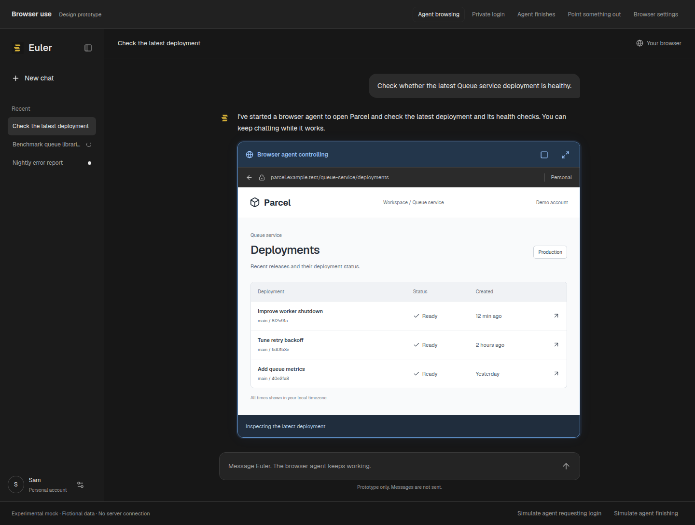
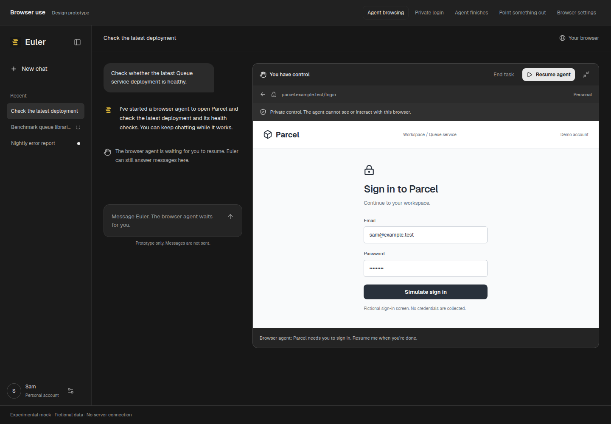
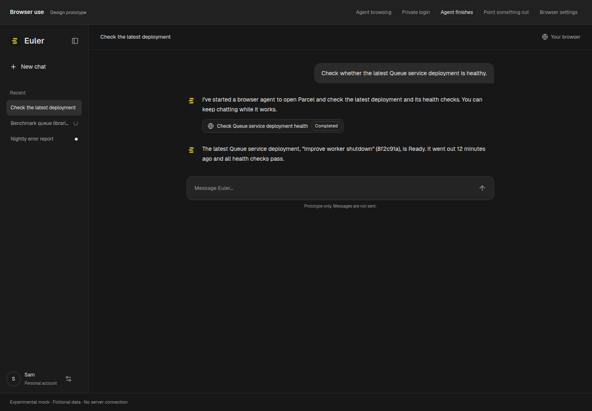
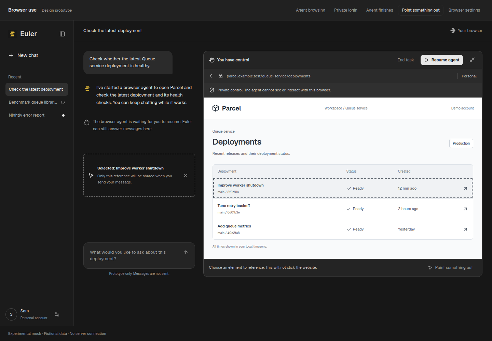
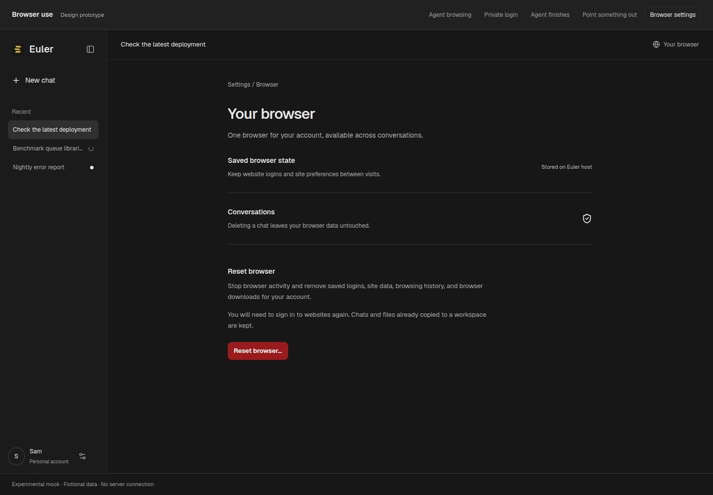
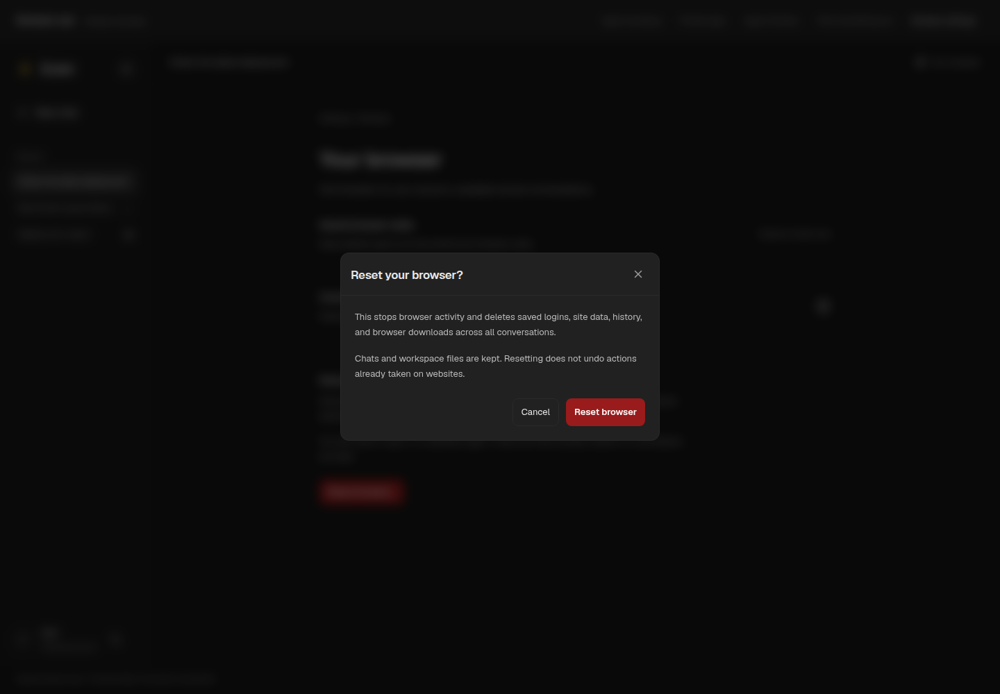
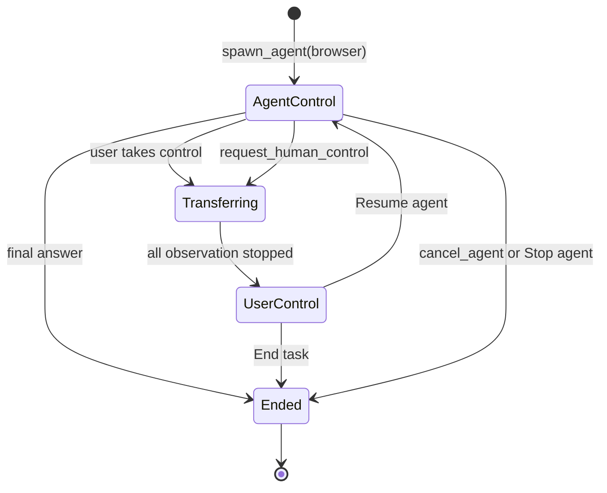
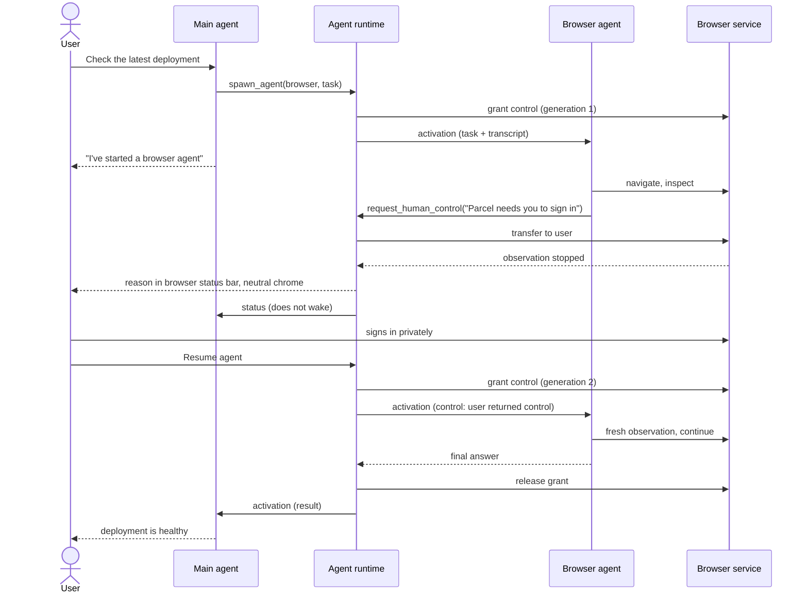
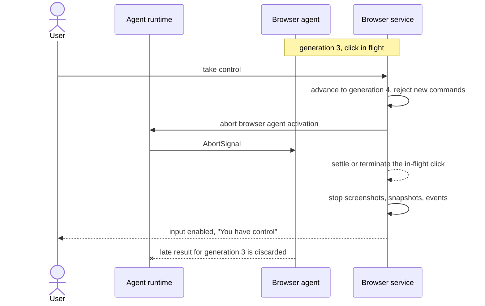
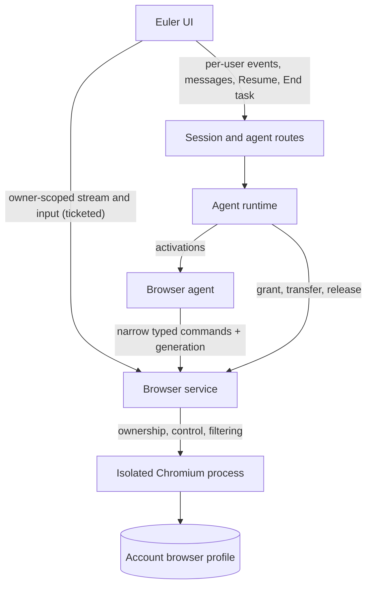

# Browser use in Euler

Status: design proposal with interactive UI mocks. No production browser service is implemented.

Updated: 2026-09-26.

## Purpose

Give agents a real browser they can navigate while the user watches, intervenes, signs in privately, and resumes the work. Preserve website logins across conversations and host restarts. Make ownership of control visible and enforce it outside the agent.

This is phase 2. It depends on [async agents](async-agents.md): the browser agent is an async subagent with its own inbox, status, and activations. The terms *activation*, *inbox*, *wake*, and *runtime* are defined there.

## Agreed product decisions

- Chromium runs on the machine running Euler, not on the user's device.
- The existing `x-euler-user-id` UUID is the ownership mechanism for this iteration. Stronger authentication is future work, not a prerequisite for this feature.
- The browser and its data belong to the user account. Chats do not own profiles or saved logins. One browser per user.
- Deleting a chat does not delete anything browser-related. Deleting it cancels its agents, which releases browser control.
- The main agent creates the browser agent. After that, the browser agent and the user share the browser. The main agent is not involved between handoffs.
- The browser agent either hands the browser to the user, or finishes its task and wakes the main agent with its result.
- The user can keep chatting with the main agent while the browser agent works or waits.
- A blue hue means the agent controls the browser. Neutral chrome, with no control hue, means the user can control it. Website colors themselves are unaffected.
- The user can take control through an icon. The agent can also ask for human help and hand over control.
- Only the user returns control, with an explicit Resume action that is always available during user control. Collapsing the preview, finishing a login, or sending a chat message never resumes the agent.

## UI direction and mocks

Reuse Euler's neutral shell and shared Button, IconButton, and Modal components. The prototype uses the bundled Geist face, a `#171717` canvas, `#212121` panels, `#e8e8e8` text, `#9b9b9b` secondary text, and `#9ac5ff` control accents over `#23364b`. In production the control accent becomes a theme token that stays distinct from each theme's accent. Blue belongs to agent control, not private takeover or element selection. Labels and icons repeat the state for people who cannot distinguish the color.

The live browser replaces the status row from phase 1 while the browser agent is live. When the agent ends, it collapses into the same one-line status row. The browser agent is also listed in phase 1's Agents panel with the same status. Stopping it there is the same as End task. The compact view sits in the conversation. Expanded mode places the browser beside the conversation on wide displays and above the composer on narrow displays. Expansion changes layout only; it does not change who controls the browser.

These screenshots show a fictional Parcel deployment dashboard, rendered from the checked-in React mock rather than a working remote browser. The mock's privacy messages describe the intended product contract. They are not evidence of implemented security.

### Agent browsing inline

The main agent started a browser agent and ended its reply. The blue frame and status bar identify agent control. The square icon takes control, beside the expand action. The composer stays enabled, and messages go to the main agent.

### Human takeover for sign-in

The browser agent called `request_human_control`. Its reason appears in the browser's own status bar and in the Agents panel, not in the transcript. The expanded browser has neutral chrome and an explicit privacy message. User input is enabled only after the service acknowledges the handoff. Resume agent and End task are both available. A real login requires the actual site's sign-in page and MFA. This fixture uses a fixed, fictional form and a simulation button.

### The browser agent finishes

The result wakes the main agent, which replies with the answer. The live browser collapses into a completed status row. The browser process can stay open for later tasks, and its logins persist.

### Point something out

Selection is an optional mode within human control. Picking an element creates a local draft reference instead of activating the website. Sending a message shares that reference with the main agent explicitly, without resuming browser access. Selection is a follow-up capability, not a prerequisite for browsing.

### Browser settings and reset

Browser settings belong to the account and explain their independence from chats. Reset requires confirmation and applies across conversations.

## The browser agent

The browser agent is an async subagent of kind `browser`:

| Property | Value |
| --- | --- |
| Started by | `spawn_agent({ kind: "browser", title, task })` from the main agent. Always runs in the background. |
| Initial context | The task, plus the chat's visible transcript: user and assistant text and earlier browser results. It does not get the main agent's raw model messages or other tools' output. |
| Tools | Browser operations (below), `send_message` for progress, `ask_parent`, and `request_human_control`. No shell, file, workspace, or spawning tools. |
| Limit | One live browser agent per user, across chats. A second `spawn_agent` returns `browser_busy` naming the chat that holds it. |
| Model | The main agent's model unless `spawn_agent` specifies one. |

Keeping browser tools out of the main agent, and other tools out of the browser agent, is a security boundary as well as a context budget. Text injected by a page reaches an agent that has no shell or filesystem. It can reach the main agent only through the browser agent's messages, which arrive in envelopes marked as untrusted.

### Status and browser control

The browser agent's status (from phase 1) and the browser's control state move together:

| Agent status | Browser control | Appearance | Who can act |
| --- | --- | --- | --- |
| `running` | Agent control | Blue, "Browser agent controlling" | Browser agent; user can watch, take control, expand |
| `running` → `waiting` | Transferring to user | Neutral, "Stopping browser agent…", input disabled | Nobody until acknowledged |
| `waiting` | User control | Neutral, "You have control" | User only; Resume and End task available |
| `completed`, `failed`, `cancelled` | Closed or idle, with the profile retained | Collapsed status row | Nobody; a new task needs a new `spawn_agent` |
| Any live status | Unavailable or disconnected | Neutral, explicit message | Nobody; control is revoked and the agent moves to `waiting` |
| — | Resetting | Neutral, explicit progress | Nobody |

Neutral color alone does not mean input is ready. Transitional and error states use labels and disabled input to distinguish themselves.

### Handoff and resume

- **The agent yields.** `request_human_control({ reason })` is a terminal tool. The service moves the browser to user control. The runtime sets the agent to `waiting` and ends its activation. It shows the reason in the browser's status bar and the Agents panel, and sends the main agent a `status` message that does not wake it. Nothing is added to the transcript.
- **The user takes control.** The square icon asks the service to transfer control. The runtime aborts the browser agent's in-flight activation, persists its history with the interrupted tool call resolved as "The user took control", and sets it to `waiting`. The chat shows the change in the browser card without a transcript row.
- **Resume agent.** The service grants a new control generation. The runtime sends a `control` message ("The user returned control. The page may have changed; observe before acting."), which wakes the browser agent with its history intact. The main agent is not called.
- **End task.** The same as `cancel_agent`: the agent is cancelled and the browser stays open under user control until closed.
- **The user messages the main agent during any of this.** The main agent answers, and can steer the browser agent with `send_message`, for example "also check staging". Those messages reach a running browser agent at its next step boundary. A waiting agent receives them at its next activation after Resume. The main agent cannot resume the browser agent; only the user can.
- **The agent finishes.** Its final answer becomes a `result` message. If the main agent is idle, the result wakes it. If the main agent is mid-reply, the result is delivered at its next step boundary. The runtime releases the control grant. The browser process may stay open for later tasks, and the profile is kept.

### Flows

## Control generation

A browser task may acquire control when the main agent starts it and the user has not reserved the browser through takeover. Once the user takes over or the agent yields, only Resume can grant control again.

The service maintains a monotonic control generation. Every browser operation carries the agent ID and generation. Takeover advances the generation, rejects stale work, and prevents old results from entering model context. Commands go through one service-owned queue. The generation is checked both before dispatch and before an observation is returned.

An in-flight click may already have caused a website action, and cancellation cannot undo it. Do not announce private control until all active observation channels and actions have stopped. If this cannot be established, keep input disabled and close or restart the browser rather than allowing an uncertain handoff.

If the user's connection drops during private control, stay private. If the browser service restarts, invalidate grants and restore into user control. The runtime's restart recovery moves live browser agents to `waiting`. As an initial conservative policy, losing every preview connection during agent control also moves the agent to `waiting`. Unattended browsing is a later policy decision.

## Proposed architecture

The browser service owns the Playwright/CDP connection. Neither agent tools nor the UI receive a raw debugging endpoint. The runtime and the browser service share one control grant per user. The runtime decides which agent holds it, and the service enforces it.

Chromium runs outside the agent shell sandbox, with its own restricted filesystem and network access. Profile storage must be inaccessible through shell tools, file tools, artifacts, selected local workspaces, or downloads. Browser isolation must preserve Chromium's sandbox rather than disabling it to simplify launch. The feasibility spike must confirm whether Chromium's sandbox works inside the containment chosen. The existing bwrap-based `SandboxRunner` is one candidate, and nested user namespaces are a known obstacle.

Use Playwright internally for launching persistent Chromium and implementing the restricted operations. Its persistent context API stores browser state in a dedicated profile directory. Avoid reusing a person's ordinary desktop Chrome profile. [Playwright persistent contexts](https://playwright.dev/docs/api/class-browsertype#browser-type-launch-persistent-context)

The UI shows a remote pixel stream, not an iframe navigating to the target site. A feasibility spike must choose between browser screencasting and remote desktop streaming, based on input fidelity, latency, popups, dialogs, clipboard, and mobile resizing. Streaming and agent observation are separate channels, so private takeover can leave the user's stream active while disabling all agent observation.

Authenticate ownership using the current UUID convention on every control request, input message, stream connection, profile lookup, and reset. UUID ownership is a known weak boundary: someone with another user's UUID may impersonate that user under the current model. Keep authorization in one service boundary so stronger identity can replace it later. This design makes no claim of strong account authentication.

For browser-native connections that cannot send the current header, establish a short-lived, owner-bound connection ticket through the UUID-scoped API. Bind it to a purpose and expiry, check the UI origin, and avoid placing enduring owner credentials in URLs or logs. This ticket does not strengthen the underlying UUID identity.

### Fit with the repository

| Responsibility | Proposed location / existing integration |
| --- | --- |
| Browser lifecycle, control queue, profile isolation | New focused modules under `src/browser/` |
| Control grant shared with the runtime | `src/browser/controlGrant.ts`, called from `src/agents/runtime/` |
| Shared validated contracts | `src/schemas/browser.ts`, following existing Zod boundaries |
| Owner-scoped lifecycle, control, stream-ticket API | `src/routes/browser.ts`, using `src/userIdentity.ts` |
| Browser agent kind and tool set | `src/agents/agentManager.ts`, browser tools under `src/tools/browser/` using `BaseTool` |
| `request_human_control` | `src/tools/browser/request_human_control.ts`, a terminal tool from phase 1 |
| Browser ownership metadata | Existing DB layer under `src/db/`; raw profile files kept separately |
| UI requests and state | `ui/persist/browser.ts` via `ui/lib/api.ts`, feature hooks |
| Live browser UI | `ui/components/Browser/`, rendered in place of the phase 1 status row while live |

A minimal metadata record needs owner UUID, profile ID, profile generation, and lifecycle state. An active grant adds agent ID, control generation, and expiry. Chat IDs may appear in transient attribution, but must not own profiles or cascade-delete browser records.

Browser operations: navigate, inspect, click a snapshot element, type ordinary text, scroll, manage tabs, and request human control with a reason. Validate arguments and ownership server-side. Element references are scoped to a tab, document revision, and control generation. Reject stale references rather than guessing their new targets.

Initially exclude arbitrary JavaScript execution, raw DOM export, cookie and storage export, network payload access, developer tools, and unrestricted file paths. No other agent kind receives browser tools.

## Credential and data boundaries

Private takeover disables agent screenshots, accessibility snapshots, events, reads, and writes across the entire browser. User keystrokes travel only through the private input path. Exclude them from chat, agent inboxes, tool traces, analytics, request logs, exception payloads, and recordings. Clipboard access must be explicit and never synchronized automatically from the user's device.

Stop producers and discard pending observations at handoff, including buffered frames. While private, avoid agent-visible page titles and URLs that might contain sensitive data. That includes the `status` message to the main agent, which carries only the agent's stated reason. Recheck on resume for secrets remaining in fields, dialogs, or pages. Password masking in screenshots is not sufficient: revealed passwords, ordinary text fields, accessibility values, and site-generated echoes can all leak secrets. Use a reviewed allowlist of snapshot fields, sensitive-field filtering, and a refusal path when the service cannot produce an appropriate observation. Do not enable agent screenshots until their protection is separately designed and tested.

Start with manual private login and persistent session state. A credential vault and password-manager integration are deferred. Local browser password saving and automatic credential filling should be disabled initially. Some identity flows, passkeys, anti-bot checks, or MFA may not work in a host browser. Validate them with test accounts and document the supported paths rather than bypassing site protections.

Meta's Muse is a relevant precedent. It puts browser debugging access behind a broker, restricts the browser subagent to accessibility snapshots without JavaScript, and pauses the agent during human takeover. Its credential vault and separate safety infrastructure are substantially broader than this proposal. [Meta's Muse security design](https://research.meta.ai/blog/security-and-safety-for-ai-agents-our-approach-with-muse)

Logged-in browsing necessarily exposes some account content to the browser agent, the main agent through its results, and their configured model provider. Private takeover does not retract earlier observations or hide all subsequent account data. Protecting credentials also does not prevent misuse of an authenticated session. Treat page content as untrusted and design action authorization for consequential submissions before broad authenticated browsing ships. Detecting arbitrary risky website actions is an unresolved engineering problem, not something a prompt alone solves.

The browser agent inherits the visible transcript, so injected page text could try to leak earlier chat content through navigation. The egress rules below and the consequential-action boundary are the protection, not the prompt.

Restrict browser egress to supported public web destinations. Enforce private-address, loopback, metadata-service, redirect, and DNS checks at the network boundary, including requests made by scripts and subresources. File URLs and host filesystem access are blocked. Downloads remain in browser-owned storage. Importing them into a workspace and uploading workspace files require explicit, scoped transfer paths. A hostile page must not gain access to Euler's own API, which listens on loopback on the same host.

## Persistence and wipeout

Keep the account profile outside session directories. Closing the process retains it, though login expiry and website revocation still apply. Avoid copying an active profile between browser processes. Profile files are sensitive even without saved passwords, because cookies may grant account access. File permissions, storage encryption, backup policy, and browser patching belong in the deployment plan.

| Operation | Result |
| --- | --- |
| Take control | Agent `waiting`; retain browser and data |
| End task, Stop agent, or `cancel_agent` | Agent cancelled; release grant; retain browser and data |
| Close browser | End process; retain account profile and browser-owned downloads |
| Delete chat | Cancel its agents, which releases the grant; no browser data deletion |
| Reset browser | Cancel any live browser agent, revoke all grants, terminate the process, delete all account browser data, create a clean profile |
| Delete user account (future lifecycle) | Must explicitly include browser data and retention policy |

Reset is a service operation with a durable deletion marker. Block new grants first, cancel the live browser agent, advance generations, and close streams and Chromium. Then delete the profile and browser-owned downloads and captures, and create a fresh profile. If any step fails or the host restarts, continue deletion before permitting access. Report partial failure instead of claiming success. An old reconnect ticket or queued command must never reopen the deleted profile.

Default to no retained browser recording or private-input capture. Browser profile directories should be excluded from ordinary backups until a retention and deletion policy is selected. If backups are later enabled, reset semantics must state when those copies expire or how keys are destroyed.

Reset does not delete chats, agent histories, or files already exported to a workspace. It cannot undo website actions, retract model-provider data, or guarantee remote revocation of copied session tokens. A compromise recovery flow should direct users to revoke website sessions as well as resetting the local browser.

Deferred: per-site deletion (federated login and shared identity-provider cookies make its scope hard to explain), multiple profiles, concurrent browser agents, unattended browsing, and a credential vault.

## Delivery and verification

Phase 1 ([async agents](async-agents.md)) ships first. Then:

1. Prove host Chromium, remote preview, ordinary input, tabs and popups, private handoff, login persistence after restart, and profile deletion with disposable accounts. Choose the streaming transport based on this spike.
2. Implement UUID ownership enforcement, process and network containment, the control generation protocol, the grant shared with the runtime, and failure recovery. Prove privacy and isolation before accepting real credentials.
3. Add the browser agent kind, its tools, `request_human_control`, the inline and expanded UI, Resume, End task, account browser settings, and reset. Ship a narrow supported workflow first.
4. Add element selection and optional richer observation after the core security and interaction behavior is demonstrated.

Required production tests include:
- cross-UUID requests and stream attachment
- shell and file access to profiles
- private network navigation
- takeover racing a pending action
- stale tool results after a generation change
- popup coverage
- credential remnants on resume
- disconnects and restart recovery into `waiting`
- persistent logins
- interrupted reset
- a second browser agent while one is live or waiting

Use synthetic secrets and assert they do not appear in model payloads, agent inboxes, logs, screenshots, or recorded artifacts. Include an adversarial page that tries to expose fields, steer the agent, or make it message the main agent with instructions. Failure of filtering must stop observation.

Browser interaction tests must cover mouse and keyboard takeover, visible focus, status announcements, mobile layout, collapse without resume, Resume always enabled during user control, End task, chatting with the main agent during user control, selection without site activation, and reset confirmation. Color cannot be the only state indicator.

## Continue this work

The mock lives in [`dev/experimental/browser-use/`](../../dev/experimental/browser-use/README.md). Open `/dev/experimental/browser-use` using the Vite dev server. The route is guarded by `import.meta.env.DEV`, so the mocks are excluded from production builds. They use local React state and static data only. The simulated handoff delay is for reviewing UI transitions and is not an implementation of the control protocol.

Before production work, resolve:
- the streaming transport
- Chromium sandboxing inside the chosen containment
- the supported login flows
- storage protection and retention
- the boundary for consequential website actions

Preserve the agreed account ownership, UUID convention, blue/neutral state indication, user-only Resume, and chat-independent persistence across those decisions.
